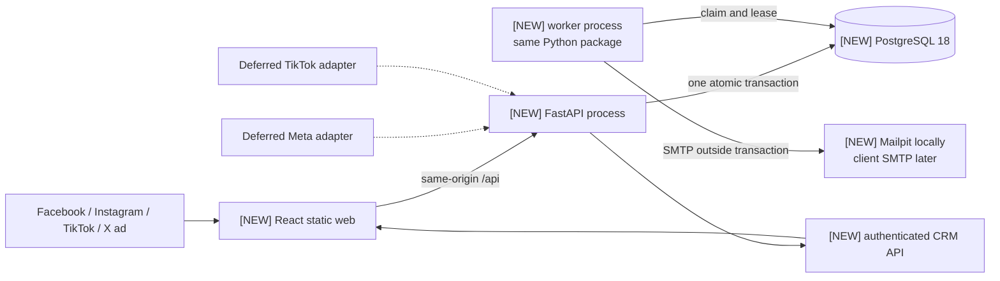

# How the real-estate lead CRM works

**Status:** implementation baseline  
**Decision date:** 2026-07-30  
**Source requirements:** [`README.md`](../README.md)  
**Implementation plan:** [`DOCS/planphases.md`](./planphases.md)

## Read this first

This document explains the technical design of the CRM for one real-estate client.

The main flow is:

```text
Facebook / Instagram / TikTok / X
  -> property form on the client's website
  -> FastAPI validates and saves the inquiry in PostgreSQL
  -> the same database transaction creates a pending email job
  -> a separate worker sends the notification email
  -> an authorized user views the inquiry in /crm/inquiries
```

The website form is the reliable lead-capture route. Future forms hosted inside Meta or TikTok require separate integrations and are not part of the working local system.

The application is a **modular monolith**. This means the frontend, API, and email worker have clear internal modules, but they remain one product and one main backend codebase. The parts are:

- a React/Vite frontend for property pages and the CRM interface;
- a FastAPI backend for validation, authentication, and database operations;
- a worker process from the same Python package for notification email; and
- PostgreSQL as the permanent source of truth.

## Technical words used in this document

- **API:** backend routes used by the browser or CRM interface.
- **Transaction:** a group of database changes that all succeed together or all fail together.
- **Outbox:** a database table of notification jobs. It prevents a saved lead from being lost when email is temporarily unavailable.
- **Idempotency:** retrying the same request safely returns the same result instead of creating a duplicate.
- **Lease:** a temporary worker claim on a job. Another worker can recover the job if the first worker crashes.
- **Modular monolith:** one deployable backend organized into separate modules, not many independent network services.
- **Native lead adapter:** code that imports a form submission hosted inside Meta or TikTok.
- **PII:** personal information, including name, email, phone number, and form answers.
- **Fail closed:** stop safely when required configuration or proof is missing.
- **TDD:** technical design document. Here it means a reviewed implementation contract, not “test-driven development.”

This design avoids paid CRM, automation, lead-routing, email API, and integration SaaS dependencies. It uses local open-source components, the client's social-ad accounts, and eventually the client's SMTP email service. Ad spend and the existing mail service are operating costs owned by the client, not hidden software dependencies.

This document was originally written before the application code was created. Labels such as `[NEW]` record the planned change at that time; they do not mean the file is still missing today. Use the current repository and [`README.md`](./README.md) to verify the present implementation.

## 1. Information still required before production

The local system can be designed and tested with fake data. The following decisions are still required before a real public launch. Do not guess them:

| Required input | Why it is needed | Owner / gate |
|---|---|---|
| Target countries and states | TikTok availability and real-estate advertising disclosures differ by jurisdiction. | Client and legal review before publishing an ad. |
| Advertiser, Meta Business, TikTok Business, and X account ownership | Native APIs must use client-owned assets and approved access. | Client before any native-adapter phase. |
| Exact public fields and qualification choices | Controls the final form schema and fair-housing review. | Client before the public form phase. |
| Approved privacy/contact notice and retention periods | Consent records must snapshot approved text; retention cannot be guessed. | Counsel/client before non-test data. |
| SMTP host, authentication mode, sender, and recipient allow-list | Required for real notification delivery. | Client before leaving Mailpit. |
| Admin users and whether an `agent` role is required | Avoids fabricating an RBAC hierarchy. | Client before CRM access. |
| Production identity choice (MFA-capable local auth or external SSO) | Local password auth is not sufficient for Internet exposure without MFA. | Production gate, outside this plan. |

At the time this design was written, only `README.md` and the design documents existed. The dependency versions were therefore proposals. The committed lockfiles and test results now provide the real compatibility evidence.

## 2. Why this is treated as a large change

**Original planning rating: XL — a new application plus local infrastructure.**

The business flow is simple, but building it requires a frontend, backend, database, email worker, login system, and local runtime. That makes the original implementation large enough to require a complete technical design. It still does not justify microservices, a message broker, Kubernetes, Redis, or cloud infrastructure before there is a measured need.

## 3. Main design decisions and affected areas

### 3.1 Decisions taken from the original research

The central recommendation in `README.md:198-263` is sound: send every supported ad to a client-owned landing page, commit the inquiry to PostgreSQL, create an outbox job in the same transaction, and send email asynchronously. PostgreSQL remains the source of truth; email is a notification, never the only record.

The following refinements are normative for implementation:

- `README.md:221-239` names Next.js/Fastify. This TDD supersedes only that stack choice to satisfy the requested Python + React foundation: React/Vite for a static web application and FastAPI for HTTP and business logic.
- `README.md:240-263` is implemented as process separation, not independent microservices. API and worker use one versioned Python package and one schema. Module boundaries permit later extraction if measured scaling or ownership requires it.
- `README.md:434-467` is refined to a claim-and-lease worker. The worker commits a claim before SMTP and never holds a row lock or transaction across network I/O. A stable `Message-ID` aids diagnosis but cannot make SMTP exactly-once.
- `README.md:427-433` must never auto-merge a lead on a single email or phone match. A repeat submission always creates an inquiry. Conflicting candidates are marked for review.
- `README.md:468-503` is refined so CSRF protection applies to authenticated cookie-based admin mutations. It does not prevent anonymous form spam. Same-origin deployment, bounded inputs, a honeypot, elapsed-time checks, and measured throttling protect the public endpoint.
- `README.md:527-539` must not use campaign, property, click ID, email, or phone as metric labels. Those are high-cardinality or sensitive; reporting comes from SQL.
- Application-level field encryption, multi-tenancy, native ingestion, conversion APIs, and cloud operations are production/deferred concerns. They are not silently half-implemented in the local MVP.

### 3.2 What each social platform can use

An ad destination URL on the owned domain is the common path; it requires no lead-retrieval API. UTM and platform click identifiers are untrusted attribution only and never authorize, select a recipient, or change server-side property data.

| Platform | Launch without ad-measurement consent/configuration | Launch after approved measurement setup | Native lead ingestion |
|---|---|---|---|
| Facebook / Instagram | Meta Traffic campaign to owned URL | Meta Leads with conversion location `Website`; Pixel/Conversions API only after consent and account setup | Optional Instant Forms adapter. Not messaging, calls, or DMs. |
| TikTok | Traffic campaign to owned URL, only in an allowed market | Lead Generation with `Website` after TikTok Pixel is configured and activated; Events API may complement it after consent | Optional Instant Forms webhook/API adapter. Disabled for India unless authoritative availability changes. |
| X | Website Traffic optimized for link clicks | Current UI may expose Sales/Web conversions after X Pixel/CAPI setup | None. Historical Lead Generation Cards are not a supported design basis. |

“Without ad measurement” in this matrix means the client site does not deploy Pixel/CAPI conversion tracking. Traffic/link-click ads still involve platform-side ad and click processing and still require the advertiser’s privacy/legal review.

Rules for a future Meta Instant Forms connection:

- Identify one Meta lead by `(page_id, leadgen_id)`. Do not invent a webhook delivery ID.
- If the CRM later serves several clients, prefix the identity with the client and provider.
- Identify a field mapping by `(page_id, form_id, returned_field_key)`.
- Verify the webhook signature on the unchanged request bytes before parsing JSON.
- Pixel and Conversions API events count as duplicates only when the dataset/pixel, event name, and event ID all match.
- Do not target minors, request prohibited or sensitive answers, sell leads, or mix one advertiser's leads with another advertiser's data.
- Obtain separate recorded permission before using a lead for anything beyond the contact purpose shown on the form.
- Choose email recipients only from server configuration. Never accept a recipient from a form or webhook request.

Rules for a future TikTok Instant Forms connection:

- TikTok documents Instant Forms and Custom API/Webhooks.
- TikTok's documented Ads Manager lead-retention window is 90 days.
- A webhook connection does not import leads collected before that connection was completed.
- Do not invent a signature header, algorithm, timestamp limit, delivery ID, retry order, or lead-list API.
- Start implementation only after the authenticated client account provides the official contract and a saved sandbox test request/response.
- A manual Ads Manager or Leads Center export is emergency recovery. Automated backfill requires a verified API endpoint.
- If Pixel and Events API are approved later, use the inquiry UUID as their shared event ID.

Legal and market rules:

- TikTok remains blocked for India unless authoritative government and platform evidence changes the decision.
- Review RERA requirements separately for the target state. Attach the state-authority source, project and agent registration proof, the exact disclosure/QR checklist, and named advertiser/legal approval.
- The software can record that a legal checklist was approved. It cannot decide whether an ad is legally valid.
- Do not apply a Maharashtra-specific QR rule to another state without evidence.
- Read DPDP commencement from the Gazette's staged schedule. Do not calculate a date yourself or claim that software controls alone create legal compliance.
- The software records the cited Gazette trigger, including the eighteen-month group for Rules 22 and 23, instead of storing a guessed date.

### 3.3 Processes and network connections



The frontend and API are same-origin outside local development. Vite proxies `/api` locally. No CORS allow-list is needed by default. The web build contains no database, SMTP, or platform secret. FastAPI owns validation, canonical property lookup, consent snapshots, idempotency, persistence, and authorization.

The API and worker are stateless apart from PostgreSQL. They can later be scaled independently from the same artifact. That is the deliberate production seam; splitting them into repositories or databases now would create distributed transactions without a business need.

### 3.4 Repository folders and responsibilities

```text
[EXISTING] README.md
[EXISTING] DOCS/Architecture.md
[EXISTING] DOCS/planphases.md

[NEW] .env.example
[NEW] .gitignore
[NEW] compose.yaml

[NEW] backend/
  pyproject.toml
  uv.lock                         # generated and committed
  alembic.ini
  migrations/
    env.py
    script.py.mako
    versions/
      0001_initial.py
      0002_admin_auth.py
  scripts/
    export_openapi.py
    create_user.py
  src/real_estate_crm/
    app.py                        # router/middleware composition only
    config.py
    db.py
    observability.py
    leads/
      models.py
      schemas.py
      normalization.py
      consent.py
      service.py
      routes.py
    notifications/
      models.py
      email.py
      worker.py
    auth/
      models.py
      service.py
      routes.py
    admin/
      service.py
      routes.py
    integrations/
      meta/                       # deferred until its contract gate passes
      tiktok/                     # deferred until its contract gate passes
  tests/

[NEW] frontend/
  package.json
  pnpm-lock.yaml                  # generated and committed
  tsconfig.json
  biome.json
  vite.config.ts
  index.html
  src/
    main.tsx
    App.tsx
    styles.css
    api/
      openapi.json                # generated and committed
      schema.d.ts                 # generated and committed
      client.ts
    features/
      lead-capture/
      auth/
      inquiries/
  e2e/
```

Capability folders own their models, routes, services, and tests. `[NEW] backend/src/real_estate_crm/app.py` composes them; it must not become a business-logic module. There is no generic repository layer, home-grown dependency injection container, shared-domain package, or internal event bus. Empty `__init__.py` package markers may be generated but are not counted as design files.

### 3.5 Required software and versions

There is no current lockfile against which versions can be verified. The following direct pins were checked against official release registries on 2026-07-30. Phase 2 and Phase 12 must resolve them together and commit `backend/uv.lock` and `frontend/pnpm-lock.yaml`; a failed resolution changes the proposal before application work begins.

| Area | Direct versions | Reason |
|---|---|---|
| Runtime | Python `3.12.10`; Node `24.18.0` LTS; PostgreSQL `18.4` | Python 3.12 is the conservative supported branch; Node 24 is LTS; tests use the same PostgreSQL major as local runtime. |
| Python packaging | `uv==0.11.29` | Reproducible Python environment and lockfile. |
| Backend | `fastapi==0.139.2`, `uvicorn==0.51.0`, `pydantic==2.13.4`, `pydantic-settings==2.14.2`, `SQLAlchemy==2.0.51`, `alembic==1.18.5`, `psycopg[binary]==3.3.4`, `email-validator==2.3.0`, `argon2-cffi==25.1.0`, `structlog==26.1.0`, `prometheus-client==0.25.0` | Stable API, validation, PostgreSQL, migrations, passwords, structured logs, and bounded operational metrics. SQLAlchemy 2.1 pre-release is excluded. |
| Backend development | `pytest==9.1.1`, `pytest-cov==7.1.0`, `httpx==0.28.1`, `ruff==0.15.22`, `mypy==2.3.0` | Tests, API test client, linting, and type checks. |
| Frontend | `react==19.2.8`, `react-dom==19.2.8`, `react-router-dom==7.18.1`, `@tanstack/react-query==5.101.2`, `react-hook-form==7.81.0` | Small SPA, explicit routing, bounded server-state cache, accessible form state. Pre-release majors are excluded. |
| Frontend development | pnpm `10.34.5`; `typescript==5.9.3`, `vite==8.1.5`, `@vitejs/plugin-react==6.0.4`, `openapi-typescript==7.13.0`, `vitest==4.1.10`, `jsdom==29.1.1`, `@playwright/test==1.61.1`, `@testing-library/react==16.3.2`, `@testing-library/dom==10.4.1`, `@testing-library/jest-dom==6.9.1`, `@biomejs/biome==2.5.5` | Type-safe generated client, unit/accessibility tests, and browser acceptance tests. TypeScript 5.9 is the latest stable line accepted by openapi-typescript 7.13's strict `^5.x` peer; TypeScript 6/7 would require bypassing the generator's declared contract. Biome 2.5.6 is deliberately not a first-adopter choice. |
| Local containers | `postgres:18.4-bookworm`, `axllent/mailpit:v1.30.0` | PostgreSQL plus a local-only SMTP sink. Ports bind to `127.0.0.1`; PostgreSQL 18 uses `/var/lib/postgresql` for its volume. |

No Celery, Redis, Kafka, JWT library, UI component system, Zod duplicate schema, or email templating engine is required. Python `EmailMessage`, `smtplib`, and `html.escape` are sufficient for the initial notifier.

### 3.6 Database structure

Alembic is the sole schema authority. The API must not call `create_all()` and must refuse readiness when the database revision is behind. Migrations run once as an explicit command, not in every API replica. Tests use PostgreSQL 18, never SQLite.

`[NEW] backend/migrations/versions/0001_initial.py` applies the following schema atomically. Alembic may express it through operations, but the resulting SQL must be equivalent:

```sql
BEGIN;

CREATE TABLE properties (
    id uuid PRIMARY KEY,
    slug text NOT NULL UNIQUE,
    title text NOT NULL,
    summary text NOT NULL DEFAULT '',
    locality text NOT NULL,
    price_label text,
    project_registration_number text,
    registration_authority_url text,
    is_active boolean NOT NULL DEFAULT true,
    created_at timestamptz NOT NULL DEFAULT now(),
    updated_at timestamptz NOT NULL DEFAULT now(),
    CONSTRAINT properties_slug_ck CHECK (slug = lower(slug) AND slug ~ '^[a-z0-9](?:[a-z0-9-]{0,78}[a-z0-9])?$'),
    CONSTRAINT properties_title_len_ck CHECK (char_length(title) BETWEEN 1 AND 160),
    CONSTRAINT properties_summary_len_ck CHECK (char_length(summary) <= 2000),
    CONSTRAINT properties_locality_len_ck CHECK (char_length(locality) BETWEEN 1 AND 160),
    CONSTRAINT properties_price_len_ck CHECK (price_label IS NULL OR char_length(price_label) <= 80),
    CONSTRAINT properties_reg_len_ck CHECK (project_registration_number IS NULL OR char_length(project_registration_number) <= 100),
    CONSTRAINT properties_reg_url_len_ck CHECK (registration_authority_url IS NULL OR char_length(registration_authority_url) <= 2048)
);

CREATE TABLE contacts (
    id uuid PRIMARY KEY,
    full_name text NOT NULL,
    normalized_email text,
    normalized_phone text,
    created_at timestamptz NOT NULL DEFAULT now(),
    updated_at timestamptz NOT NULL DEFAULT now(),
    CONSTRAINT contacts_name_len_ck CHECK (char_length(full_name) BETWEEN 1 AND 120),
    CONSTRAINT contacts_email_len_ck CHECK (normalized_email IS NULL OR char_length(normalized_email) <= 254),
    CONSTRAINT contacts_phone_ck CHECK (normalized_phone IS NULL OR normalized_phone ~ '^\+[1-9][0-9]{7,14}$'),
    CONSTRAINT contacts_method_ck CHECK (normalized_email IS NOT NULL OR normalized_phone IS NOT NULL)
);
CREATE INDEX contacts_email_idx ON contacts (normalized_email) WHERE normalized_email IS NOT NULL;
CREATE INDEX contacts_phone_idx ON contacts (normalized_phone) WHERE normalized_phone IS NOT NULL;

CREATE TABLE inquiries (
    id uuid PRIMARY KEY,
    public_reference text NOT NULL UNIQUE,
    contact_id uuid NOT NULL REFERENCES contacts(id) ON DELETE RESTRICT,
    property_id uuid NOT NULL REFERENCES properties(id) ON DELETE RESTRICT,
    source_platform text NOT NULL,
    capture_surface text NOT NULL DEFAULT 'website',
    form_version text NOT NULL,
    intent text,
    budget_band text,
    timeframe text,
    preferred_contact_method text,
    message text,
    status text NOT NULL DEFAULT 'new',
    dedupe_state text NOT NULL DEFAULT 'clear',
    version integer NOT NULL DEFAULT 1,
    submitted_at timestamptz NOT NULL DEFAULT now(),
    updated_at timestamptz NOT NULL DEFAULT now(),
    CONSTRAINT inquiries_public_ref_ck CHECK (public_reference ~ '^RE-[A-Z0-9]{10}$'),
    CONSTRAINT inquiries_source_ck CHECK (source_platform IN ('facebook','instagram','tiktok','x','direct','unknown')),
    CONSTRAINT inquiries_surface_ck CHECK (capture_surface IN ('website')),
    CONSTRAINT inquiries_form_version_len_ck CHECK (char_length(form_version) BETWEEN 1 AND 40),
    CONSTRAINT inquiries_intent_ck CHECK (intent IS NULL OR intent IN ('buy','rent','sell','information')),
    CONSTRAINT inquiries_budget_len_ck CHECK (budget_band IS NULL OR char_length(budget_band) <= 40),
    CONSTRAINT inquiries_timeframe_len_ck CHECK (timeframe IS NULL OR char_length(timeframe) <= 40),
    CONSTRAINT inquiries_contact_method_ck CHECK (preferred_contact_method IS NULL OR preferred_contact_method IN ('email','phone','whatsapp','no_preference')),
    CONSTRAINT inquiries_message_len_ck CHECK (message IS NULL OR char_length(message) <= 2000),
    CONSTRAINT inquiries_status_ck CHECK (status IN ('new','contacted','qualified','viewing','won','lost','closed')),
    CONSTRAINT inquiries_dedupe_ck CHECK (dedupe_state IN ('clear','review')),
    CONSTRAINT inquiries_version_ck CHECK (version > 0)
);
CREATE INDEX inquiries_submitted_idx ON inquiries (submitted_at DESC, id DESC);
CREATE INDEX inquiries_status_idx ON inquiries (status, submitted_at DESC);
CREATE INDEX inquiries_contact_idx ON inquiries (contact_id, submitted_at DESC);
CREATE INDEX inquiries_property_idx ON inquiries (property_id, submitted_at DESC);

CREATE TABLE consent_records (
    inquiry_id uuid PRIMARY KEY REFERENCES inquiries(id) ON DELETE CASCADE,
    notice_version text NOT NULL,
    notice_text text NOT NULL,
    notice_sha256 bytea NOT NULL,
    locale text NOT NULL,
    requested_contact boolean NOT NULL,
    marketing_opt_in boolean NOT NULL DEFAULT false,
    ad_measurement_opt_in boolean NOT NULL DEFAULT false,
    capture_surface text NOT NULL,
    recorded_at timestamptz NOT NULL DEFAULT now(),
    CONSTRAINT consent_notice_version_len_ck CHECK (char_length(notice_version) BETWEEN 1 AND 40),
    CONSTRAINT consent_notice_text_len_ck CHECK (char_length(notice_text) BETWEEN 1 AND 8000),
    CONSTRAINT consent_notice_hash_ck CHECK (octet_length(notice_sha256) = 32),
    CONSTRAINT consent_locale_len_ck CHECK (char_length(locale) BETWEEN 2 AND 20),
    CONSTRAINT consent_contact_ck CHECK (requested_contact),
    CONSTRAINT consent_surface_ck CHECK (capture_surface IN ('website'))
);

CREATE TABLE attribution_touches (
    id uuid PRIMARY KEY,
    inquiry_id uuid NOT NULL REFERENCES inquiries(id) ON DELETE CASCADE,
    touch_type text NOT NULL DEFAULT 'submission',
    utm_source text,
    utm_medium text,
    utm_campaign text,
    utm_content text,
    utm_term text,
    click_id_kind text,
    click_id_value text,
    landing_path text NOT NULL,
    referrer_origin_path text,
    captured_at timestamptz NOT NULL DEFAULT now(),
    CONSTRAINT attribution_one_touch_uk UNIQUE (inquiry_id, touch_type),
    CONSTRAINT attribution_touch_ck CHECK (touch_type IN ('submission')),
    CONSTRAINT attribution_source_len_ck CHECK (utm_source IS NULL OR char_length(utm_source) <= 100),
    CONSTRAINT attribution_medium_len_ck CHECK (utm_medium IS NULL OR char_length(utm_medium) <= 100),
    CONSTRAINT attribution_campaign_len_ck CHECK (utm_campaign IS NULL OR char_length(utm_campaign) <= 200),
    CONSTRAINT attribution_content_len_ck CHECK (utm_content IS NULL OR char_length(utm_content) <= 200),
    CONSTRAINT attribution_term_len_ck CHECK (utm_term IS NULL OR char_length(utm_term) <= 200),
    CONSTRAINT attribution_click_kind_ck CHECK (click_id_kind IS NULL OR click_id_kind IN ('fbclid','ttclid','twclid')),
    CONSTRAINT attribution_click_value_len_ck CHECK (click_id_value IS NULL OR char_length(click_id_value) <= 512),
    CONSTRAINT attribution_click_pair_ck CHECK ((click_id_kind IS NULL) = (click_id_value IS NULL)),
    CONSTRAINT attribution_landing_len_ck CHECK (char_length(landing_path) BETWEEN 1 AND 2048),
    CONSTRAINT attribution_referrer_len_ck CHECK (referrer_origin_path IS NULL OR char_length(referrer_origin_path) <= 2048)
);

CREATE TABLE idempotency_requests (
    endpoint text NOT NULL,
    key uuid NOT NULL,
    request_sha256 bytea NOT NULL,
    inquiry_id uuid,
    response_status smallint,
    response_body jsonb,
    created_at timestamptz NOT NULL DEFAULT now(),
    expires_at timestamptz NOT NULL,
    PRIMARY KEY (endpoint, key),
    CONSTRAINT idempotency_endpoint_len_ck CHECK (char_length(endpoint) BETWEEN 1 AND 100),
    CONSTRAINT idempotency_hash_ck CHECK (octet_length(request_sha256) = 32),
    CONSTRAINT idempotency_status_ck CHECK (response_status IS NULL OR response_status BETWEEN 200 AND 599),
    CONSTRAINT idempotency_complete_ck CHECK ((inquiry_id IS NULL) = (response_status IS NULL) AND (response_status IS NULL) = (response_body IS NULL)),
    CONSTRAINT idempotency_expiry_ck CHECK (expires_at > created_at),
    CONSTRAINT idempotency_inquiry_fk FOREIGN KEY (inquiry_id) REFERENCES inquiries(id) ON DELETE CASCADE
);
CREATE INDEX idempotency_expiry_idx ON idempotency_requests (expires_at);

CREATE TABLE outbox_jobs (
    id uuid PRIMARY KEY,
    job_kind text NOT NULL,
    aggregate_id uuid NOT NULL,
    dedupe_key text NOT NULL UNIQUE,
    payload jsonb NOT NULL,
    state text NOT NULL DEFAULT 'pending',
    attempts integer NOT NULL DEFAULT 0,
    available_at timestamptz NOT NULL DEFAULT now(),
    locked_by text,
    locked_at timestamptz,
    last_error_code text,
    smtp_message_id text,
    created_at timestamptz NOT NULL DEFAULT now(),
    completed_at timestamptz,
    CONSTRAINT outbox_kind_ck CHECK (job_kind IN ('lead_email')),
    CONSTRAINT outbox_state_ck CHECK (state IN ('pending','processing','completed','dead')),
    CONSTRAINT outbox_attempts_ck CHECK (attempts BETWEEN 0 AND 12),
    CONSTRAINT outbox_dedupe_len_ck CHECK (char_length(dedupe_key) BETWEEN 1 AND 160),
    CONSTRAINT outbox_payload_object_ck CHECK (jsonb_typeof(payload) = 'object'),
    CONSTRAINT outbox_error_len_ck CHECK (last_error_code IS NULL OR char_length(last_error_code) <= 80),
    CONSTRAINT outbox_message_id_len_ck CHECK (smtp_message_id IS NULL OR char_length(smtp_message_id) <= 254),
    CONSTRAINT outbox_lock_pair_ck CHECK ((locked_by IS NULL) = (locked_at IS NULL)),
    CONSTRAINT outbox_completion_ck CHECK ((state = 'completed') = (completed_at IS NOT NULL))
);
CREATE INDEX outbox_due_idx ON outbox_jobs (available_at, id) WHERE state = 'pending';
CREATE INDEX outbox_stale_idx ON outbox_jobs (locked_at, id) WHERE state = 'processing';

COMMIT;
```

`[NEW] backend/migrations/versions/0002_admin_auth.py` is additive and backward-compatible. It must not rewrite or lock the inquiries table longer than the metadata-only nullable-column operation:

```sql
BEGIN;

CREATE TABLE users (
    id uuid PRIMARY KEY,
    normalized_email text NOT NULL UNIQUE,
    display_name text NOT NULL,
    password_hash text NOT NULL,
    role text NOT NULL,
    is_active boolean NOT NULL DEFAULT true,
    created_at timestamptz NOT NULL DEFAULT now(),
    updated_at timestamptz NOT NULL DEFAULT now(),
    CONSTRAINT users_email_len_ck CHECK (char_length(normalized_email) <= 254),
    CONSTRAINT users_name_len_ck CHECK (char_length(display_name) BETWEEN 1 AND 120),
    CONSTRAINT users_role_ck CHECK (role IN ('admin','agent'))
);

CREATE TABLE sessions (
    id uuid PRIMARY KEY,
    user_id uuid NOT NULL REFERENCES users(id) ON DELETE CASCADE,
    token_sha256 bytea NOT NULL UNIQUE,
    csrf_sha256 bytea NOT NULL,
    created_at timestamptz NOT NULL DEFAULT now(),
    last_seen_at timestamptz NOT NULL DEFAULT now(),
    idle_expires_at timestamptz NOT NULL,
    absolute_expires_at timestamptz NOT NULL,
    revoked_at timestamptz,
    CONSTRAINT sessions_token_hash_ck CHECK (octet_length(token_sha256) = 32),
    CONSTRAINT sessions_csrf_hash_ck CHECK (octet_length(csrf_sha256) = 32),
    CONSTRAINT sessions_expiry_order_ck CHECK (idle_expires_at <= absolute_expires_at AND absolute_expires_at > created_at)
);
CREATE INDEX sessions_user_active_idx ON sessions (user_id, absolute_expires_at) WHERE revoked_at IS NULL;

CREATE TABLE lead_status_history (
    id uuid PRIMARY KEY,
    inquiry_id uuid NOT NULL REFERENCES inquiries(id) ON DELETE CASCADE,
    actor_user_id uuid NOT NULL REFERENCES users(id) ON DELETE RESTRICT,
    from_status text NOT NULL,
    to_status text NOT NULL,
    created_at timestamptz NOT NULL DEFAULT now(),
    CONSTRAINT history_from_status_ck CHECK (from_status IN ('new','contacted','qualified','viewing','won','lost','closed')),
    CONSTRAINT history_to_status_ck CHECK (to_status IN ('new','contacted','qualified','viewing','won','lost','closed')),
    CONSTRAINT history_change_ck CHECK (from_status <> to_status)
);
CREATE INDEX lead_status_history_inquiry_idx ON lead_status_history (inquiry_id, created_at, id);

CREATE TABLE audit_events (
    id uuid PRIMARY KEY,
    actor_user_id uuid REFERENCES users(id) ON DELETE SET NULL,
    action text NOT NULL,
    entity_type text NOT NULL,
    entity_id uuid NOT NULL,
    request_id uuid NOT NULL,
    context jsonb NOT NULL DEFAULT '{}'::jsonb,
    created_at timestamptz NOT NULL DEFAULT now(),
    CONSTRAINT audit_action_len_ck CHECK (char_length(action) BETWEEN 1 AND 80),
    CONSTRAINT audit_entity_type_len_ck CHECK (char_length(entity_type) BETWEEN 1 AND 40),
    CONSTRAINT audit_context_object_ck CHECK (jsonb_typeof(context) = 'object')
);
CREATE INDEX audit_entity_idx ON audit_events (entity_type, entity_id, created_at, id);

ALTER TABLE inquiries
    ADD COLUMN assigned_user_id uuid;

ALTER TABLE inquiries
    ADD CONSTRAINT inquiries_assigned_user_fk
    FOREIGN KEY (assigned_user_id) REFERENCES users(id) ON DELETE SET NULL;
CREATE INDEX inquiries_assignee_idx ON inquiries (assigned_user_id, submitted_at DESC) WHERE assigned_user_id IS NOT NULL;

COMMIT;
```

The downgrade for `0002` drops the new foreign key/index, then the four new tables in dependency order. The downgrade for `0001` is allowed only in local/test and drops all initial tables in reverse dependency order. Production data deletion is never an automated deployment step.

Native Meta/TikTok schema is deliberately unspecified. Exact delivery identity, credential storage, mapping, quarantine, and reconciliation columns are designed only after the platform contract gate supplies official payloads and account permissions. Guessing that schema would violate the anti-hallucination rule.

## 4. Saving data safely and recovering from failures

### 4.1 Public API rules

`POST /api/v1/leads` accepts JSON only, with a maximum decoded body of 16 KiB and a required `Idempotency-Key` UUIDv4 header. Each key expires 48 hours after creation. The browser creates the key on the first submit and stores it in `sessionStorage` across an ambiguous network failure. Editing the payload after such a failure creates a new key.

| Field | Server rule |
|---|---|
| `propertySlug` | 1–80 lowercase ASCII slug; resolve an active property server-side. |
| `fullName` | Trimmed Unicode length 1–120; reject control characters. |
| `email` | Optional, maximum 254; syntax normalization only, with DNS deliverability disabled in the request path. |
| `phone` | Optional E.164 matching `^\+[1-9]\d{7,14}$`. At least email or phone is required. |
| `intent` | Optional: `buy`, `rent`, `sell`, or `information`. |
| `budgetBand`, `timeframe` | Optional, approved server values with a maximum serialized length of 40. |
| `preferredContactMethod` | Optional: `email`, `phone`, `whatsapp`, or `no_preference`; must be compatible with supplied contact data. |
| `message` | Optional, maximum 2,000; render escaped as text in email. |
| `formVersion` | 1–40; assertion for diagnosis only. The server selects canonical notice text/version. |
| UTM fields | Source/medium 100; campaign/content/term 200. Treat as opaque untrusted attribution. |
| Click identifier | `fbclid`, `ttclid`, or `twclid`; maximum 512. Never authorization. |
| Landing/referrer | Persist origin and path only, maximum 2,048; discard arbitrary query data. |

The success response is `201` with `inquiryId`, non-sequential `reference`, `status`, and `submittedAt`. A same-key/same-normalized-body retry returns the stored `201` response. A same-key/different-body retry returns `409`. Unknown/invalid fields return `422`; inactive/missing property returns `404`; a database-unavailable request returns `503` and never displays success.

The complete local API surface is deliberately small:

| Method and route | Access | Contract |
|---|---|---|
| `GET /api/v1/properties/{slug}` | Public | Approved fields for one active property; `404` otherwise. |
| `POST /api/v1/leads` | Public | Lead transaction above; idempotency header required. |
| `POST /api/v1/auth/login` | Public | Establish session and CSRF cookies; generic `401` on failure. |
| `GET /api/v1/auth/session` | Session | Current user/role only. |
| `POST /api/v1/auth/logout` | Session + CSRF | Revoke current session and clear both cookies. |
| `GET /api/v1/inquiries` | `admin` or `agent` | Cursor page, size 1–100, bounded status/property/assignee filters. |
| `GET /api/v1/inquiries/{id}` | `admin` or `agent` | Inquiry, contact, property, consent summary, status history, and current `version`. |
| `GET /api/v1/users` | `admin` or `agent` | Active assignee choices: opaque ID, display name, and role only. |
| `PATCH /api/v1/inquiries/{id}/status` | `admin` or `agent` + CSRF | A different defined status plus `expectedVersion`; atomic history/audit. No stricter workflow graph is invented before client approval. |
| `PATCH /api/v1/inquiries/{id}/assignment` | `admin` or `agent` + CSRF | Active assignee or `null` plus `expectedVersion`; atomic audit. |
| `GET /health/live`, `GET /health/ready`, `GET /metrics` | Local operations | Liveness, database/migration readiness, and bounded Prometheus metrics; loopback-only in this plan. |

### 4.2 Save the inquiry, consent, attribution, and email job together

One PostgreSQL `READ COMMITTED` transaction performs:

1. Insert `(endpoint, idempotency key)` with `ON CONFLICT DO NOTHING`.
2. On conflict, compare the SHA-256 of canonical normalized input and return the stored response or `409`.
3. Acquire sorted transaction-scoped advisory locks derived from normalized contact keys so concurrent matching is deterministic.
4. Reuse a contact only when every supplied normalized method resolves to the same row. No match creates a contact. Partial or conflicting matches create a new contact with `dedupe_state='review'`.
5. Insert the inquiry, canonical consent snapshot/hash, submission attribution touch, and one `lead_email` outbox job whose payload contains opaque IDs only.
6. Store the exact `201` response on the idempotency row and commit before responding.

No SMTP, DNS, platform call, or other network I/O occurs inside that transaction. If any write fails, all writes roll back. An SMTP outage does not change the accepted `201`; the durable outbox remains pending.

### 4.3 Prevent duplicate email jobs and recover crashed workers

`[NEW] backend/src/real_estate_crm/notifications/worker.py` claims at most 20 due rows with `FOR UPDATE SKIP LOCKED`, updates them to `processing` with `locked_by`, `locked_at`, and incremented `attempts`, then commits. SMTP runs after that commit. Success or failure is recorded in a new transaction guarded by the same `locked_by` value.

- Lease: two minutes; SMTP connect/read timeout: ten seconds. Stale `processing` rows are reclaimable.
- Transient failures: connection/timeouts and SMTP 4xx. Retry with exponential delay beginning at 30 seconds, capped at six hours, with ±50% random jitter.
- Terminal failures: invalid allow-listed recipient, SMTP authentication failure, permanent SMTP 5xx, 12 attempts, or 24 hours since job creation. Mark `dead` and emit an error log/metric.
- Stable message ID: `<outbox-uuid@client-domain>`. Because a process can crash after SMTP acceptance and before the completion commit, duplicate email remains possible and is documented.
- Database unavailable: the API returns `503`; the worker stops claiming and retries database connection with bounded local backoff. It never falls back to memory or email-only acceptance.
- Idempotency cleanup: once per hour, one worker obtains a transaction-scoped advisory lock on a fixed maintenance key and deletes at most 1,000 expired `idempotency_requests` rows in a short transaction. Other workers skip that cycle; no inquiry is deleted by this maintenance job.

### 4.4 Handle two CRM users editing at the same time

Status and assignment mutations execute `UPDATE inquiries ... WHERE id=:id AND version=:expected_version`, increment `version`, append status history when applicable, and write an audit event in the same transaction. Zero updated rows returns `409`; the UI refreshes instead of overwriting another agent’s change.

### 4.5 Caching decisions

There is no Redis, server-side application cache, or persistent browser cache.

- React Query `['property', slug]`: stale after 60 seconds. Lead submission always revalidates property activity inside the write transaction.
- `['inquiries', normalizedFilters]`: stale after 10 seconds.
- `['inquiry', id]`: stale after 5 seconds.
- Status/assignment mutations invalidate the affected detail and all inquiry-list keys.
- Sensitive API responses send `Cache-Control: private, no-store`; the query cache is memory-only and is cleared at logout. Static hashed assets may be cached immutably.

These are the complete cache keys, TTLs, and invalidation triggers for this scope. There is no hidden cache to synchronize.

## 5. Security, logs, monitoring, and tests

### 5.1 Login and permissions

Local login uses these exact rules:

- Hash passwords with Argon2id.
- Create random 32-byte session tokens, but store only their SHA-256 hashes.
- Put the session in a cookie limited to the current host. Set `HttpOnly`, `SameSite=Lax`, path `/`, and `Secure` outside local development.
- Use a second host-only CSRF cookie containing only the random CSRF value. The same-origin frontend may read this cookie. Check it against both the request header and the SHA-256 hash stored with the session.
- End a session after 12 total hours or 30 minutes without activity. Check expiry on every request. Update `last_seen_at` no more than once every five minutes.
- Make logout and administrator revocation effective immediately in PostgreSQL.

Local password and login-rate rules:

- Accept 8–128 Unicode characters and no more than 512 UTF-8 bytes. Do not require fragile patterns such as a mandatory symbol or uppercase letter.
- Use Argon2id with memory cost 65,536 KiB, time cost 3, parallelism 1, a random 16-byte salt, and a 32-byte hash.
- In Phase 21, measure ten hashes. The 95th-percentile time must be at most 500 ms on the target development computer. If not, review the parameters and this decision together.
- During local development, allow five failed attempts per normalized account and 20 per source IP during 15 minutes, followed by a 15-minute cooldown. Always return a generic failure message.
- This in-process limit resets with the process. It is not the future production edge control.

Authenticated CRM changes must come from the same origin and include a valid CSRF token bound to the server session. The anonymous public lead form has no authenticated user authority, so it does not use CSRF protection. It instead uses validation and abuse controls. The only initial roles are `admin` and `agent`: an admin manages users and configuration; both roles may view and update inquiries. Do not expose the CRM publicly until an MFA-capable identity design is approved.

Configuration fails closed outside the explicit `local` environment if secure-cookie mode, trusted public origin, privacy notice, recipient allow-list, or SMTP authentication is absent. Database and Mailpit ports bind only to `127.0.0.1` locally.

### 5.2 Protect personal data and the public form

The local database stores personal information without application-level field encryption. This is an honest local limitation, not a claim of complete cryptography. Keep the database on the developer computer, keep it out of Git and ordinary backups, and use fake data only. A public deployment remains blocked until a production privacy/security design covers retention, user-rights requests, deletion, encrypted backups, key management, and any application-level encryption or keyed lookup indexes.

Logging rules:

- Never log request or response bodies, URL query strings, names, email addresses, phone numbers, click IDs, session/CSRF tokens, SMTP credentials, password hashes, or raw webhook bodies.
- Do not store raw IP addresses as application data.

Local public-form rate limiting:

- Use only the direct peer IP while processing the request; do not trust a forwarded header.
- Give each peer a capacity of five requests, refilled at one request per minute.
- Give the whole process a capacity of 60 requests, refilled at one request per second.
- Remove an idle peer bucket after 15 minutes and keep no more than 10,000 buckets.
- Return `429` with a bounded `Retry-After` value when a limit is exhausted.
- Reject a filled hidden honeypot field with the same generic validation response.
- Record a form completed in under one second as a signal only; do not reject it for speed alone.
- This guard resets on restart and protects only one process. Do not describe it as distributed production protection.
- Choose future edge throttling or CAPTCHA only after measuring abuse and correctly configuring trusted proxies. Do not block an entire carrier-NAT population because several people share an IP.

Property disclosures and selectable qualification fields are server-owned. Ads and forms must not encode discriminatory housing targeting or request sensitive/special-category data. Marketing and ad-measurement opt-ins are separate from the required request-to-contact action.

### 5.3 Logs, measurements, and health checks

Structured JSON events:

| Event | Level | Safe context |
|---|---|---|
| `http.request.completed` | info | request ID, route template, method, status, duration |
| `lead.accepted`, `lead.idempotent_replay` | info | request ID, opaque inquiry/property IDs, bounded source/surface |
| `lead.rejected` | info/warn | request ID, bounded validation/error code; never submitted values |
| `outbox.claimed` | debug | job ID, worker ID, attempt |
| `email.sent` | info | job/inquiry IDs, attempt, duration |
| `email.retry_scheduled` | warn | job ID, attempt, bounded error class, next due time |
| `email.dead` | error | job ID, attempt, bounded terminal reason |
| `auth.login.failed` | warn | request ID and bounded reason; no account identifier |
| `admin.inquiry.changed` | info | request ID, actor/inquiry IDs, action, old/new bounded status |

Operational metrics measure request count/latency by route template and status class, lead acceptance/rejection/replay/conflict counts, pending/dead outbox count, oldest pending age, email outcomes/latency, login failures, and stale-version conflicts. Labels are bounded enums only. Campaign/property/source-detail reports are SQL queries, not time-series labels.

`GET /health/live` checks process liveness only. `GET /health/ready` verifies PostgreSQL connectivity and the exact Alembic head; SMTP health does not make the API unready because accepted leads remain durable.

### 5.4 Tests that must pass

- Schema: blank upgrade, downgrade/upgrade round trip in local/test, constraints, and no drift from SQLAlchemy metadata.
- Public path: Unicode/bounds, E.164, inactive property, same-key replay, key/payload conflict, concurrent contact matching, rollback, and database outage.
- Worker: two-worker exclusion, lease recovery, no transaction held during SMTP, escaped content, transient/permanent classification, duplicate-delivery acknowledgement, and dead-job alert.
- Auth/CRM: constant-work failed login using a dummy hash, session expiry/revocation, CSRF/origin checks, role boundaries, pagination, optimistic conflict, and atomic history/audit.
- Browser: mobile and keyboard form flow, double-click, ambiguous network retry, lead-to-PostgreSQL-to-Mailpit path, login boundary, and conflict refresh.
- Privacy/observability: log redaction and absence of sensitive/high-cardinality metric labels.

## 6. Order in which the system was built

The exact, independently verifiable implementation sequence is in [`DOCS/planphases.md`](./planphases.md). It limits every phase to no more than three principal files and keeps the owned website path ahead of CRM UI and native integrations.

The local release boundary ends after the website, database, worker, email, auth, CRM, and failure-path phases pass. Native Meta and TikTok work is conditional and begins with evidence/contract documents, not code. X has no inbound phase. Cloud deployment, conversion APIs, production secrets, MFA/SSO, field encryption, backups/PITR, platform reconciliation schedules, and multi-tenancy require later TDDs backed by real client assets and production requirements.

## Important decisions kept for future work

| Decision | Chosen | Rejected now | Revisit trigger |
|---|---|---|---|
| Service shape | One modular backend package; API and worker processes | Independent microservices/databases | Independent teams, materially different scaling, or isolation requirement. |
| Queue | PostgreSQL transactional outbox with claim/lease | FastAPI background tasks, Redis, Celery, Kafka | Measured queue volume/latency exceeds PostgreSQL operating target. |
| Frontend | Static React/Vite SPA, same-origin API | Node SSR service | Proven SEO/social-preview requirement that static metadata cannot meet. |
| Source of truth | PostgreSQL inquiry record | Email inbox or platform lead center | Never for this product. |
| Native platforms | Conditional Meta/TikTok adapters; no X inbound | Day-one integrations | Website path passes release gate and client assets/contracts exist. |
| Multi-tenancy | One client | Tenant columns and generic SaaS abstractions | A second contracted client and isolation requirements. |
| Local PII | Synthetic data only; no field-encryption claim | Partial DIY encryption | Non-local data, after lifecycle/key-management TDD. |

## Sources for decisions that can change over time

- Platform references and official-source register: `README.md:677-743`.
- Meta lead ads, terms, and website conversion location: [Meta for Business — Lead ads](https://www.facebook.com/business/ads/ad-objectives/lead-generation/lead-ads-with-forms), [Meta Lead Ads Terms](https://www.facebook.com/ads/leadgen/tos).
- TikTok Lead Generation destinations, API, and retention: [TikTok Ads Manager — Lead Generation](https://ads.tiktok.com/help/article/lead-generation-objective), [TikTok for Business API](https://business-api.tiktok.com/portal), [TikTok — access lead data](https://ads.tiktok.com/help/article/access-leads-data?lang=en&redirected=2).
- X campaign objectives: [X Ads — campaign objectives](https://business.x.com/en/help/campaign-setup/campaign-objectives).
- India platform/legal gates: [Government of India 2020 app-blocking order](https://www.pib.gov.in/PressReleasePage.aspx?PRID=1635206), [Real Estate (Regulation and Development) Act](https://www.indiacode.nic.in/handle/123456789/2158?view_type=browse), [MahaRERA Order 46/2023](https://maharera.maharashtra.gov.in/sites/default/files/Orders_and_circulars/115.pdf), [DPDP commencement notification](https://upload.indiacode.nic.in/showfile?actid=AC_CEN_45_0_00003_2023-22_1763464807080&filename=c56ceae6c383460ca69577428d36828b.pdf&type=notification), and [DPDP Rules](https://upload.indiacode.nic.in/showfile?actid=AC_CEN_45_0_00003_2023-22_1763464807080&filename=dpdprules2025.pdf&type=rule).
- PostgreSQL queue locking behavior: [PostgreSQL 18 `SELECT`](https://www.postgresql.org/docs/18/sql-select.html).
- Runtime lifecycles: [Python release announcement](https://blog.python.org/2026/06/python-3146-31314/), [Node.js 24.18.0 LTS](https://nodejs.org/en/blog/release/v24.18.0), [PostgreSQL versioning](https://www.postgresql.org/support/versioning/).
