# How the CRM was built: implementation phases

**Design authority:** [`DOCS/Architecture.md`](./Architecture.md)  
**Research input:** [`README.md`](../README.md)  
**Scope:** local development foundation; zero cloud deployment work

## How to read and use this plan

This file records the order used to build the CRM described in [`Architecture.md`](./Architecture.md). It is primarily for developers changing or auditing the code.

Each phase has four useful labels:

- **Scope:** the expected number of main files and approximate amount of code.
- **What:** the result the phase must create.
- **Pattern:** the earlier design rule that this work must follow.
- **Verify:** the command or test that must pass before the phase is complete.

`[CREATE] [NEW]` describes the file state when this plan was written. It does not mean the file is missing from the repository today. `[MODIFY]` means a later phase changes a file created by an earlier phase.

The work was split into small phases so the repository could remain runnable and testable. Each phase changes no more than three main files and is complete only when its listed checks pass. Generated package markers and test snapshots are not counted as main files, but unexplained generated code is not allowed.

When this plan was created, the application files, manifests, lockfiles, and database schema did not yet exist. The plan therefore labels the original paths `[NEW]`. When a later phase changes a file from an earlier phase, the plan names both the original file and the design rule that controls the change.

Run commands in PowerShell from the repository root. After Phase 1, keep PostgreSQL and Mailpit running with `docker compose up -d postgres mailpit`. Tests must use PostgreSQL 18 through `TEST_DATABASE_URL`; do not replace it with SQLite. Passing only unit tests is not enough when the phase also requires a build, migration, integration, or browser check.

### What may use fake data and what remains blocked

- Phases 1–19 may use synthetic properties, contacts, and inquiries.
- Before Phase 17, the client must approve public fields, contact notice text, form version, and property disclosures. If absent, use visibly marked test fixtures only; do not publish.
- Before Phase 20, the client must identify the first admin and confirm whether the `agent` role is needed.
- Phase 28 may use Mailpit only. Switching to client SMTP or non-local data is outside this plan.
- Phases 29–30 collect platform evidence only. They do not authorize native adapter code.

## Build the local CRM

### Phase 1: Loopback-only local dependencies

*Scope*: 3 files, ~120 LOC  
*Verify*: `docker compose config`

#### [CREATE] [NEW] `compose.yaml`

- **What:** Define `postgres:18.4-bookworm` and `axllent/mailpit:v1.30.0`, named volumes, health checks, and explicit service names `postgres` and `mailpit`.
- **Pattern:** Implement the local boundary from `DOCS/Architecture.md` §3.3 and §3.5; preserve the owned-database invariant from `README.md:198-239`.
- **System design:** Bind PostgreSQL and Mailpit host ports to `127.0.0.1` only. Mount PostgreSQL 18 data at `/var/lib/postgresql`. Do not add API/web containers, TLS, cloud emulators, or an external queue.

#### [CREATE] [NEW] `.env.example`

- **What:** Document non-secret local values for environment name, database/test URLs, public origin, canonical notice version/text, SMTP host/port, sender domain, and recipient allow-list.
- **Pattern:** Use configuration gates from `DOCS/Architecture.md` §1 and §5.1.
- **System design:** Values are examples only. No credential, real lead, client email, or platform token may be committed. Production-only settings remain explicit and unset.

#### [CREATE] [NEW] `.gitignore`

- **What:** Exclude `.env`, virtual environments, caches, coverage/browser output, frontend build output, local exports, and database dumps while retaining both lockfiles and generated OpenAPI artifacts.
- **Pattern:** Apply the synthetic/local-data boundary in `DOCS/Architecture.md` §5.2.
- **System design:** Never ignore migration files, `backend/uv.lock`, `frontend/pnpm-lock.yaml`, or generated API contracts because drift must remain reviewable.

### Phase 2: Backend toolchain and fail-closed settings

*Scope*: 3 files, ~240 LOC plus generated lock data  
*Verify*: `uv lock --project backend --check`

#### [CREATE] [NEW] `backend/pyproject.toml`

- **What:** Require Python `==3.12.10`, declare the exact backend/runtime/test pins from `DOCS/Architecture.md` §3.5, and configure `src` packaging, Ruff, mypy, pytest, and coverage.
- **Pattern:** The dependency table in `DOCS/Architecture.md` §3.5 is authoritative; there is no older manifest to preserve.
- **System design:** Keep runtime and development dependency groups separate. Do not add Celery, Redis, async database drivers, JWT, platform SDKs, or cryptography in this scope.

#### [CREATE] [NEW] `backend/uv.lock`

- **What:** Generate and commit the complete resolution from `backend/pyproject.toml` using uv 0.11.29.
- **Pattern:** Satisfy the no-current-lockfile caveat in `DOCS/Architecture.md` §3.5.
- **System design:** Never hand-edit. If resolution or smoke import fails, update the proposed direct pin and the TDD before continuing; do not use an unbounded version range as a workaround.

#### [CREATE] [NEW] `backend/src/real_estate_crm/config.py`

- **What:** Define typed settings for environment, database URLs, canonical notice, origins, cookies, SMTP, recipient allow-list, body limits, and worker timing.
- **Pattern:** Use exact bounds and gates from `DOCS/Architecture.md` §4.1, §4.3, and §5.1.
- **System design:** Reject unknown settings. Permit insecure cookies and unauthenticated Mailpit only when `environment=local`. Redact secrets in representations. Fail startup for missing canonical notice or empty recipient allow-list. Pin idempotency expiry to 48 hours and session refresh writes to no more than once per five minutes.

### Phase 3: PostgreSQL connection and migration harness

*Scope*: 3 files, ~230 LOC  
*Verify*: `uv run --project backend alembic -c backend/alembic.ini current`

#### [CREATE] [NEW] `backend/src/real_estate_crm/db.py`

- **What:** Create the synchronous SQLAlchemy engine/session factory, transaction context, connectivity probe, and database exception boundary.
- **Pattern:** Use the single-database topology and transaction rules from `DOCS/Architecture.md` §3.3 and §4.2.
- **System design:** Pool connections are validated before use; request sessions never cross threads or escape request scope. There is no retry around a partially executed transaction and no runtime `create_all()`.

#### [CREATE] [NEW] `backend/alembic.ini`

- **What:** Configure Alembic logging and migration discovery without embedding a database credential.
- **Pattern:** Use the schema-authority rule from `DOCS/Architecture.md` §3.6.
- **System design:** Resolve the URL through typed settings in `config.py`; migration invocation is explicit and one-shot.

#### [CREATE] [NEW] `backend/migrations/env.py`

- **What:** Bind SQLAlchemy metadata and settings to online migrations; reject offline execution when exact PostgreSQL behavior is required.
- **Pattern:** Follow `backend/src/real_estate_crm/db.py` from this phase and `DOCS/Architecture.md` §3.6.
- **System design:** Import every model module explicitly so autogeneration cannot omit tables. Do not run migrations during API or worker startup.

### Phase 4: Core persistence model

*Scope*: 3 files, ~430 LOC  
*Verify*: `uv run --project backend ruff check backend && uv run --project backend mypy backend/src`

#### [CREATE] [NEW] `backend/src/real_estate_crm/leads/models.py`

- **What:** Map properties, contacts, inquiries, consent records, attribution touches, and idempotency requests exactly to migration `0001`.
- **Pattern:** Use the exact SQL in `DOCS/Architecture.md` §3.6, not an inferred ORM model.
- **System design:** Use application-generated UUID4 values and timezone-aware timestamps. Email/phone are indexed but not unique. Changeable workflow values remain text plus database checks, not PostgreSQL enum types.

#### [CREATE] [NEW] `backend/src/real_estate_crm/notifications/models.py`

- **What:** Map the `outbox_jobs` queue row.
- **Pattern:** Use `DOCS/Architecture.md` §3.6 and worker invariants in §4.3.
- **System design:** Payload permits opaque entity IDs only; no names, contact fields, SMTP credentials, or rendered email. State/attempt/lock constraints are represented in both model and migration.

#### [CREATE] [NEW] `backend/migrations/script.py.mako`

- **What:** Define deterministic revision templates with typed upgrade/downgrade functions and no runtime data access.
- **Pattern:** Use the explicit-migration rule in `DOCS/Architecture.md` §3.6.
- **System design:** Every revision must state lock/backfill implications. Initial schema is transactional; later changes default to additive and nullable-first.

### Phase 5: Initial schema and migration proof

*Scope*: 3 files, ~520 LOC  
*Verify*: `uv run --project backend pytest backend/tests/test_migrations.py -q`

#### [CREATE] [NEW] `backend/migrations/versions/0001_initial.py`

- **What:** Create and downgrade the exact initial schema and indexes specified in `DOCS/Architecture.md` §3.6.
- **Pattern:** Use the SQL verbatim in behavior and constraints; use model metadata from `backend/src/real_estate_crm/leads/models.py` and `notifications/models.py` only as a drift check.
- **System design:** Upgrade from an empty PostgreSQL 18 database atomically. Downgrade is local/test-only and drops objects in reverse foreign-key order. No seed data or real client values belong in a migration.

#### [CREATE] [NEW] `backend/tests/conftest.py`

- **What:** Provide isolated PostgreSQL sessions, revision setup, transaction cleanup, deterministic clock/UUID seams, and synthetic property factories.
- **Pattern:** Enforce the PostgreSQL-only test rule in `DOCS/Architecture.md` §3.6.
- **System design:** Refuse to run destructive test setup unless the database name/URL is explicitly the test database. Never point tests at the development database by default.

#### [CREATE] [NEW] `backend/tests/test_migrations.py`

- **What:** Prove blank-to-current-head upgrade, schema constraints/indexes, metadata drift absence, and revision-by-revision downgrade/upgrade round trips so later additive migrations inherit the check.
- **Pattern:** Validate every DDL invariant in `DOCS/Architecture.md` §3.6.
- **System design:** Include invalid status, malformed phone, duplicate slug, incomplete idempotency response, incomplete click-ID pair, and outbox lock-pair constraint failures.

### Phase 6: Lead input and normalization contract

*Scope*: 3 files, ~430 LOC  
*Verify*: `uv run --project backend pytest backend/tests/test_lead_schemas.py -q`

#### [CREATE] [NEW] `backend/src/real_estate_crm/leads/schemas.py`

- **What:** Define strict public request/response and internal normalized value schemas.
- **Pattern:** Implement `DOCS/Architecture.md` §4.1 and the MVP fields in `README.md:289-330`.
- **System design:** Reject unknown fields and control characters; enforce the 16 KiB body before parsing. Client form/notice versions are assertions only. Business choices are closed server enums.

#### [CREATE] [NEW] `backend/src/real_estate_crm/leads/normalization.py`

- **What:** Normalize email syntax, E.164 phone, whitespace, property slug, bounded attribution, sanitized landing/referrer, and canonical request bytes for hashing.
- **Pattern:** Use field rules from `DOCS/Architecture.md` §4.1 and untrusted-attribution rule from §3.2.
- **System design:** Disable email DNS checks in the request path. Preserve Unicode names after trim/control rejection. Strip query strings from landing/referrer before persistence. Normalization must be deterministic across retries.

#### [CREATE] [NEW] `backend/tests/test_lead_schemas.py`

- **What:** Cover each boundary, Unicode, missing contact methods, incompatible preferred method, unknown values/fields, E.164 cases, URL sanitization, and canonical-hash stability.
- **Pattern:** Test the exact table in `DOCS/Architecture.md` §4.1.
- **System design:** Add payloads at 16 KiB and one byte above. Verify click IDs cannot influence a property, source-of-truth field, recipient, or authorization decision.

### Phase 7: Atomic lead acceptance

*Scope*: 3 files, ~520 LOC  
*Verify*: `uv run --project backend pytest backend/tests/test_lead_service.py -q`

#### [CREATE] [NEW] `backend/src/real_estate_crm/leads/consent.py`

- **What:** Select the server-owned notice, compute its SHA-256, and produce the immutable consent snapshot.
- **Pattern:** Use `README.md:311-320` and `DOCS/Architecture.md` §4.1.
- **System design:** Required contact consent, optional marketing, and optional ad measurement remain separate. Server time, canonical version/text/hash, locale, and capture surface override client assertions.

#### [CREATE] [NEW] `backend/src/real_estate_crm/leads/service.py`

- **What:** Implement property revalidation, idempotency, contact matching, inquiry/consent/attribution writes, outbox insertion, and stored success response in one transaction.
- **Pattern:** Follow the ordered transaction in `DOCS/Architecture.md` §4.2 and models from Phase 4.
- **System design:** Use sorted transaction advisory locks for supplied contact keys. Reuse only one contact matching all supplied identifiers; otherwise create a contact and mark review. Idempotency expires after 48 hours. No network I/O. A repeat inquiry is never discarded. Outbox payload contains only inquiry/property IDs.

#### [CREATE] [NEW] `backend/tests/test_lead_service.py`

- **What:** Prove commit/rollback, same-key replay, body mismatch `409`, concurrent identical/different contact submissions, conflicting identifiers, inactive property, consent snapshot, and outbox atomicity.
- **Pattern:** Assert every invariant in `DOCS/Architecture.md` §4.2.
- **System design:** Run real concurrent PostgreSQL transactions. Verify a failed outbox insert leaves no inquiry, and a successful transaction creates exactly one outbox job per inquiry.

### Phase 8: Public API assembly

*Scope*: 3 files, ~390 LOC  
*Verify*: `uv run --project backend pytest backend/tests/test_lead_routes.py -q`

#### [CREATE] [NEW] `backend/src/real_estate_crm/leads/routes.py`

- **What:** Expose property lookup and `POST /api/v1/leads`, parse the UUIDv4 idempotency header, enforce content type/body size, and map domain failures to the defined statuses.
- **Pattern:** Use `README.md:331-395`, `DOCS/Architecture.md` §4.1, and `leads/service.py` from Phase 7.
- **System design:** Return success only after commit. Database unavailability becomes sanitized `503`; constraint/internal failures are not exposed. Public responses are `private, no-store`. In this HTTP module, apply the local direct-peer token buckets from `DOCS/Architecture.md` §5.2 (5 capacity/1 per minute per peer; 60 capacity/1 per second global; 15-minute/10,000-entry bound), generic honeypot rejection, and telemetry-only sub-one-second completion signal. Never trust `X-Forwarded-For` locally.

#### [CREATE] [NEW] `backend/src/real_estate_crm/app.py`

- **What:** Assemble FastAPI, lead router, request-ID middleware, exception mapping, and local trusted-origin settings.
- **Pattern:** Keep composition-only responsibility from `DOCS/Architecture.md` §3.4.
- **System design:** No business logic or global session. CORS is absent under same-origin deployment. OpenAPI exposes public schemas without secrets/internal models.

#### [CREATE] [NEW] `backend/tests/test_lead_routes.py`

- **What:** Verify `201`, stored replay `201`, key/body `409`, malformed `400/413/415/422`, property `404`, local `429`/`Retry-After`, honeypot/timing behavior, database `503`, headers, and secret-free error bodies.
- **Pattern:** Use the HTTP contract in `DOCS/Architecture.md` §4.1.
- **System design:** Simulate an ambiguous response after commit and prove the retry returns the same inquiry/reference without an extra outbox row.

### Phase 9: Durable worker claim and lease

*Scope*: 2 files, ~430 LOC  
*Verify*: `uv run --project backend pytest backend/tests/test_worker_claiming.py -q`

#### [CREATE] [NEW] `backend/src/real_estate_crm/notifications/worker.py`

- **What:** Implement the worker entry point, batch claim, committed lease, stale-lease recovery, guarded completion, retry scheduling, hourly expired-idempotency cleanup, and graceful shutdown.
- **Pattern:** Use `notifications/models.py` from Phase 4 and exact policy in `DOCS/Architecture.md` §4.3.
- **System design:** Claim at most 20 via `FOR UPDATE SKIP LOCKED`; commit before handler I/O. Lease two minutes. Delay starts at 30 seconds, caps at six hours, and uses ±50% jitter. Dead after 12 attempts or 24 hours. Once hourly, use one fixed transaction advisory lock to delete at most 1,000 expired idempotency rows; concurrent workers skip. Database loss never falls back to memory.

#### [CREATE] [NEW] `backend/tests/test_worker_claiming.py`

- **What:** Test two-worker exclusion, maximum batch, lease ownership, stale recovery, guarded completion, backoff bounds, terminal limits, idempotency cleanup exclusion/batch bound, cancellation, and database reconnect behavior.
- **Pattern:** Assert the queue state machine from `DOCS/Architecture.md` §4.3.
- **System design:** Instrument transactions to prove no row lock/transaction remains open while the handler is invoked.

### Phase 10: SMTP notification adapter

*Scope*: 3 files, ~430 LOC  
*Verify*: `uv run --project backend pytest backend/tests/test_email_delivery.py -q`

#### [CREATE] [NEW] `backend/src/real_estate_crm/notifications/email.py`

- **What:** Load inquiry/property/contact after claim, render a plain-text plus escaped HTML email, enforce the recipient allow-list, and send with Python stdlib SMTP.
- **Pattern:** Implement `README.md:434-467` as refined by `DOCS/Architecture.md` §4.3.
- **System design:** Ten-second network timeout. Stable `<outbox-uuid@client-domain>` Message-ID. Classify connection/timeouts and SMTP 4xx as transient; auth, invalid recipient configuration, and SMTP 5xx as terminal. Do not claim delivery receipt or exactly-once behavior.

#### [MODIFY] [NEW] `backend/src/real_estate_crm/notifications/worker.py`

- **What:** Dispatch `lead_email` jobs to the SMTP adapter and persist its typed success/transient/terminal result.
- **Pattern:** Extend the claim/lease state machine created in Phase 9.
- **System design:** Re-read PII only after the claim commits. Validate lease ownership before recording outcome. Payload remains opaque IDs, and email failures never mutate inquiry acceptance.

#### [CREATE] [NEW] `backend/tests/test_email_delivery.py`

- **What:** Verify Mailpit delivery, recipient allow-list, Unicode, HTML escaping, header-injection rejection, stable Message-ID, timeout, SMTP codes, retry/dead transitions, and post-send crash behavior.
- **Pattern:** Use `email.py` and `worker.py` plus duplicate-delivery caveat in `DOCS/Architecture.md` §4.3.
- **System design:** Explicitly test “SMTP accepted, completion commit failed”; the row is retried and potential duplicate is observable.

### Phase 11: Operational signals and health

*Scope*: 3 files, ~400 LOC  
*Verify*: `uv run --project backend pytest backend/tests/test_observability.py -q`

#### [CREATE] [NEW] `backend/src/real_estate_crm/observability.py`

- **What:** Configure JSON logs, redaction, bounded counters/histograms/gauges, request IDs, and liveness/readiness probes.
- **Pattern:** Implement the event/metric tables in `DOCS/Architecture.md` §5.3 and correct `README.md:527-539`.
- **System design:** Never use property/campaign/contact/click IDs as metric labels. Readiness checks database plus Alembic head, not SMTP. Logs accept allow-listed keys only.

#### [MODIFY] [NEW] `backend/src/real_estate_crm/app.py`

- **What:** Install observability middleware and expose `/health/live`, `/health/ready`, and loopback-only `/metrics`.
- **Pattern:** Extend the composition root created in Phase 8; health behavior comes from `DOCS/Architecture.md` §5.3.
- **System design:** Use route templates rather than raw URLs; query strings are never logged. A request ID is generated/validated within a fixed length and returned to the caller.

#### [CREATE] [NEW] `backend/tests/test_observability.py`

- **What:** Verify event names/levels/context, redaction, bounded labels, request IDs, process liveness, migration-aware readiness, and SMTP-independence.
- **Pattern:** Assert `DOCS/Architecture.md` §5.3.
- **System design:** Inject representative PII/secrets/click IDs and fail the test if any appear in captured logs or metric text.

### Phase 12: Frontend dependency baseline

*Scope*: 3 files, ~190 LOC plus generated lock data  
*Verify*: `pnpm --dir frontend install --frozen-lockfile && pnpm --dir frontend exec tsc --noEmit`

#### [CREATE] [NEW] `frontend/package.json`

- **What:** Declare exact Node `24.18.0`/pnpm `10.34.5` engines, the React/runtime/development pins, and scripts for build, typecheck, format, unit, and browser tests.
- **Pattern:** Use the dependency table in `DOCS/Architecture.md` §3.5.
- **System design:** Keep API types generated from FastAPI; do not duplicate validation with Zod. Exclude SSR, a UI framework, analytics, and platform SDKs.

#### [CREATE] [NEW] `frontend/pnpm-lock.yaml`

- **What:** Generate and commit the pnpm 10.34.5 resolution.
- **Pattern:** Satisfy the dependency-evidence rule in `DOCS/Architecture.md` §3.5.
- **System design:** Never hand-edit. A resolution failure changes the manifest/TDD, not the lockfile by force.

#### [CREATE] [NEW] `frontend/tsconfig.json`

- **What:** Enable strict TypeScript, modern browser modules, no unchecked index access, and deterministic path aliases limited to `src`.
- **Pattern:** Treat generated `src/api/schema.d.ts` as the API type authority in later phases.
- **System design:** No emit from typecheck; Vite owns builds. Avoid aliases that cross the frontend boundary.

### Phase 13: Frontend build scaffold

*Scope*: 3 files, ~160 LOC  
*Verify*: `pnpm --dir frontend exec biome check . && pnpm --dir frontend exec vite build`

#### [CREATE] [NEW] `frontend/biome.json`

- **What:** Configure formatting, import organization, and lint rules for application/test files.
- **Pattern:** Use `@biomejs/biome==2.5.5` from Phase 12.
- **System design:** Generated OpenAPI/type files are excluded from formatting, not rewritten manually.

#### [CREATE] [NEW] `frontend/vite.config.ts`

- **What:** Configure React, deterministic output, local `/api` proxy, Vitest/jsdom, and strict development host/port.
- **Pattern:** Implement same-origin topology from `DOCS/Architecture.md` §3.3.
- **System design:** Proxy only `/api`; do not proxy arbitrary hosts or expose secrets through `VITE_*`. Production output is static hashed assets.

#### [CREATE] [NEW] `frontend/index.html`

- **What:** Provide accessible document metadata, generic safe social metadata, viewport, and the application mount.
- **Pattern:** Use public landing-page responsibilities from `README.md:289-330`.
- **System design:** Do not embed a client token, real property claim, tracking script, or consent-assuming pixel. Property-specific data is server-owned at runtime.

### Phase 14: Accessible application shell

*Scope*: 3 files, ~300 LOC  
*Verify*: `pnpm --dir frontend exec vite build`

#### [CREATE] [NEW] `frontend/src/main.tsx`

- **What:** Mount React, router, and a memory-only QueryClient with the TDD defaults.
- **Pattern:** Use caching rules from `DOCS/Architecture.md` §4.5.
- **System design:** Do not persist query data to browser storage. Install one error boundary; avoid global mutable application state.

#### [CREATE] [NEW] `frontend/src/App.tsx`

- **What:** Define public property/confirmation routes and authenticated CRM route boundaries with explicit not-found/error states.
- **Pattern:** Use topology from `DOCS/Architecture.md` §3.3 and form UX from `README.md:321-330`.
- **System design:** Route guards are UX only; FastAPI authorization remains authoritative. No ad platform logic in routing.

#### [CREATE] [NEW] `frontend/src/styles.css`

- **What:** Provide responsive tokens, visible focus, validation/error/success states, and a readable mobile layout without a component framework.
- **Pattern:** Implement accessibility requirements in `README.md:321-330`.
- **System design:** Maintain WCAG-aware contrast, reduced-motion support, touch targets, and layout stability. No remote font or tracker dependency.

### Phase 15: Deterministic OpenAPI contract

*Scope*: 3 files, ~250 LOC plus generated JSON  
*Verify*: `uv run --project backend pytest backend/tests/test_openapi.py -q`

#### [CREATE] [NEW] `backend/scripts/export_openapi.py`

- **What:** Export sorted, deterministic OpenAPI JSON from the assembled FastAPI application.
- **Pattern:** Use `backend/src/real_estate_crm/app.py` from Phase 11 as the sole source.
- **System design:** The export performs no database connection or migration. Internal persistence/secret fields must not enter public schemas.

#### [CREATE] [NEW] `frontend/src/api/openapi.json`

- **What:** Commit the generated HTTP contract for review and frontend type generation.
- **Pattern:** Generated only by `backend/scripts/export_openapi.py`.
- **System design:** Never hand-edit. Deterministic generation must produce no diff when backend contracts are unchanged.

#### [CREATE] [NEW] `backend/tests/test_openapi.py`

- **What:** Assert stable operation IDs, expected public routes/statuses, schema strictness, and absence of secrets/internal fields.
- **Pattern:** Validate the contract from `DOCS/Architecture.md` §4.1.
- **System design:** Fail on duplicate operation IDs or an undocumented public mutation.

### Phase 16: Typed frontend API client

*Scope*: 3 files, ~340 LOC plus generated types  
*Verify*: `pnpm --dir frontend run api:generate && pnpm --dir frontend test -- src/api/client.test.ts`

#### [CREATE] [NEW] `frontend/src/api/schema.d.ts`

- **What:** Generate TypeScript definitions from `frontend/src/api/openapi.json` using `openapi-typescript`.
- **Pattern:** The OpenAPI artifact from Phase 15 is the only source.
- **System design:** Never hand-edit or redefine request/response interfaces elsewhere.

#### [CREATE] [NEW] `frontend/src/api/client.ts`

- **What:** Implement same-origin fetch, typed JSON/error decoding, abort handling, credentials for CRM routes, required idempotency support, and a generic CSRF-header hook for authenticated mutations.
- **Pattern:** Use HTTP statuses from `DOCS/Architecture.md` §4.1 and same-origin rule from §3.3.
- **System design:** No automatic retry of mutations. Query retries are bounded to transient failures. For authenticated mutations, read the host-only CSRF cookie and copy it to the documented header; never persist it elsewhere. Error objects never echo raw response HTML or secrets.

#### [CREATE] [NEW] `frontend/src/api/client.test.ts`

- **What:** Verify URL construction, credentials, response mapping, abort, malformed response handling, and no mutation retry.
- **Pattern:** Test `frontend/src/api/client.ts` against the generated types.
- **System design:** Assert that click/UTM input does not alter endpoint selection or headers other than the normalized request body.

### Phase 17: Lead form behavior

*Scope*: 3 files, ~560 LOC  
*Verify*: `pnpm --dir frontend test -- src/features/lead-capture/LeadForm.test.tsx`

#### [CREATE] [NEW] `frontend/src/features/lead-capture/LeadForm.tsx`

- **What:** Render approved fields/notice, accessible validation, honeypot, elapsed-time marker, submission state, and recovery from ambiguous failures.
- **Pattern:** Use `README.md:289-330`, generated API types from Phase 16, and `DOCS/Architecture.md` §4.1.
- **System design:** Generate one UUIDv4 at first submit and retain it in `sessionStorage` for the identical payload. Edits after ambiguity generate a new key. Disable duplicate clicks without treating the disabled state as idempotency. Marketing and measurement choices remain separate.

#### [CREATE] [NEW] `frontend/src/features/lead-capture/LeadForm.test.tsx`

- **What:** Test labels/errors/focus, keyboard submission, field bounds, double-click, retry-key reuse, edited-payload new key, server statuses, and notice choices.
- **Pattern:** Assert `LeadForm.tsx` against `DOCS/Architecture.md` §4.1.
- **System design:** Simulate committed-but-response-lost behavior. Ensure client clocks and client notice text are never sent as authority.

#### [CREATE] [NEW] `frontend/src/features/lead-capture/lead-form.css`

- **What:** Style the form, disclosure, errors, progress, and success link using shell tokens.
- **Pattern:** Extend `frontend/src/styles.css` from Phase 14.
- **System design:** Preserve focus visibility, reduced motion, 44px touch targets, and layout stability on slow/error states.

### Phase 18: Property landing page

*Scope*: 3 files, ~440 LOC  
*Verify*: `pnpm --dir frontend test -- src/features/lead-capture/PropertyPage.test.tsx`

#### [CREATE] [NEW] `frontend/src/features/lead-capture/PropertyPage.tsx`

- **What:** Fetch the property by slug, render approved public fields/disclosures, capture bounded attribution, and mount `LeadForm`.
- **Pattern:** Use URL contract in `README.md:264-288` and caching in `DOCS/Architecture.md` §4.5.
- **System design:** Cache property query for 60 seconds in memory only. Treat UTMs/click IDs as opaque. Missing/inactive property renders a non-submittable state; server revalidates on submit.

#### [MODIFY] [NEW] `frontend/src/App.tsx`

- **What:** Bind `/p/:propertySlug`, confirmation, and error routes to the landing-page flow.
- **Pattern:** Extend the route shell created in Phase 14.
- **System design:** Do not derive a property or recipient from UTM/click values. Clear form idempotency state only after unambiguous `201`.

#### [CREATE] [NEW] `frontend/src/features/lead-capture/PropertyPage.test.tsx`

- **What:** Verify valid/missing/inactive property, loading/failure, disclosure rendering, attribution bounds, source fallback, and form wiring.
- **Pattern:** Test `PropertyPage.tsx` against `README.md:264-330`.
- **System design:** Include hostile query strings and prove only bounded, sanitized attribution reaches the API request.

### Phase 19: Owned-path browser acceptance

*Scope*: 2 files, ~360 LOC  
*Verify*: `pnpm --dir frontend exec playwright test frontend/e2e/lead-submission.spec.ts`

#### [CREATE] [NEW] `frontend/playwright.config.ts`

- **What:** Configure Chromium, mobile/desktop projects, trace-on-retry, isolated test server URLs, and bounded timeouts.
- **Pattern:** Use the local process topology from `DOCS/Architecture.md` §3.3.
- **System design:** Point only to the explicit test database and Mailpit. Traces/screenshots are test artifacts and must not contain real PII.

#### [CREATE] [NEW] `frontend/e2e/lead-submission.spec.ts`

- **What:** Prove ad URL → property page → accessible form → API commit → PostgreSQL outbox → Mailpit, including keyboard/mobile, double-click, ambiguous retry, and SMTP outage acceptance.
- **Pattern:** Cover `README.md:605-648` and the test obligations in `DOCS/Architecture.md` §5.4.
- **System design:** Assert one inquiry/outbox job per submission, exact stored replay after lost response, canonical consent snapshot, sanitized attribution, and no success on database failure.

### Phase 20: Additive admin/auth storage

*Scope*: 3 files, ~500 LOC  
*Verify*: `uv run --project backend pytest backend/tests/test_migrations.py -q`

#### [CREATE] [NEW] `backend/src/real_estate_crm/auth/models.py`

- **What:** Map users, sessions, status history, audit events, and the nullable inquiry assignee.
- **Pattern:** Use exact `0002` SQL in `DOCS/Architecture.md` §3.6 and inquiry model from Phase 4.
- **System design:** Store only session/CSRF SHA-256 hashes. Roles are `admin` and `agent` only. Audit context has allow-listed non-sensitive keys.

#### [CREATE] [NEW] `backend/migrations/versions/0002_admin_auth.py`

- **What:** Apply the exact additive schema from `DOCS/Architecture.md` §3.6 with a local/test downgrade.
- **Pattern:** Extend `0001_initial.py`; do not rewrite existing inquiries.
- **System design:** Add the nullable assignee and index after users exist. No default admin credential or real email in the migration.

#### [MODIFY] [NEW] `backend/migrations/env.py`

- **What:** Register the new auth model module with Alembic metadata discovery.
- **Pattern:** Extend the explicit model-import list created in Phase 3; the generic `backend/tests/test_migrations.py` from Phase 5 validates the populated `0001` → `0002` path, constraints, drift, and downgrade/upgrade.
- **System design:** Keep migration discovery deterministic; do not import the FastAPI app or trigger configuration/network side effects. The generic migration proof must preserve every pre-existing inquiry and reject credential seeding or lead-schema rewrites.

### Phase 21: Session authentication core

*Scope*: 3 files, ~520 LOC  
*Verify*: `uv run --project backend pytest backend/tests/test_auth_service.py -q`

#### [CREATE] [NEW] `backend/src/real_estate_crm/auth/service.py`

- **What:** Implement Argon2id verification, constant-work dummy failure, session issue/lookup/idle refresh/revocation, CSRF verification, and role checks.
- **Pattern:** Use models from Phase 20 and `DOCS/Architecture.md` §5.1.
- **System design:** Generate 32 random bytes for tokens; store SHA-256 only. Absolute 12 hours, idle 30 minutes, refresh write no more than every five minutes. Passwords are 8–128 Unicode characters/512 UTF-8 bytes; Argon2id uses 65,536 KiB, time cost 3, parallelism 1, 16-byte salt, and 32-byte hash. Apply ephemeral local throttles of five failures/account and 20/source IP per 15 minutes with a 15-minute cooldown. Generic errors prevent enumeration.

#### [CREATE] [NEW] `backend/scripts/create_local_user.py`

- **What:** Provide the sole local user-bootstrap command, accepting an email, display name, and closed `admin`/`agent` role while reading the password through a non-echoing prompt.
- **Pattern:** Use `auth/service.py` from this phase and the local-only boundary in `DOCS/Architecture.md` §5.1.
- **System design:** Refuse to run unless `environment=local`; never accept a password in an argument/environment value or print its hash. Normalize email, reject duplicate identities/unknown roles, and perform one transactional insert. It is not a production user-provisioning mechanism.

#### [CREATE] [NEW] `backend/tests/test_auth_service.py`

- **What:** Verify correct/incorrect credentials, local-user bootstrap guards, password bounds/Argon2 parameters and benchmark, dummy-hash path, throttling, token hashing, idle/absolute expiry, revocation, CSRF verification, roles, and constant-shape errors.
- **Pattern:** Assert `DOCS/Architecture.md` §5.1–5.3 against `auth/service.py`.
- **System design:** Include concurrent logout/session lookup and expired-session cases. Never snapshot a raw token into test output.

### Phase 22: Authentication HTTP assembly

*Scope*: 3 files, ~400 LOC  
*Verify*: `uv run --project backend pytest backend/tests/test_auth_routes.py -q`

#### [CREATE] [NEW] `backend/src/real_estate_crm/auth/routes.py`

- **What:** Expose login, logout, and current session; set/clear the opaque session and CSRF cookies.
- **Pattern:** Use service from Phase 21 and same-origin rules in `DOCS/Architecture.md` §5.1.
- **System design:** The session cookie is `HttpOnly`; the random CSRF cookie is readable only so the frontend can copy it to the header. Both are host-only, `SameSite=Lax`, `Secure` outside local, and fixed-path. Mutations require Origin, header/cookie equality, and a match to the session-bound CSRF hash. Auth responses are `private, no-store`.

#### [MODIFY] [NEW] `backend/src/real_estate_crm/app.py`

- **What:** Register the auth router and its documented security/error dependencies.
- **Pattern:** Extend the composition root from Phase 11; keep business logic in `auth/service.py`.
- **System design:** Do not weaken public routes or add global CORS. Auth middleware must not log cookie or CSRF values.

#### [CREATE] [NEW] `backend/tests/test_auth_routes.py`

- **What:** Verify cookies, login/logout/current-session statuses, Origin/CSRF failures, role dependency, cache headers, and log redaction through the assembled app.
- **Pattern:** Test `auth/routes.py` as registered in `app.py`.
- **System design:** Prove public lead submission still works without a session and authenticated mutations fail closed.

### Phase 23: CRM inquiry service

*Scope*: 2 files, ~460 LOC  
*Verify*: `uv run --project backend pytest backend/tests/test_admin_service.py -q`

#### [CREATE] [NEW] `backend/src/real_estate_crm/admin/service.py`

- **What:** Implement cursor-paginated inquiry list/detail, active-user assignee choices, and atomic status/assignment mutations with history/audit.
- **Pattern:** Use models from Phases 4/20 and concurrency rule in `DOCS/Architecture.md` §4.4.
- **System design:** Cursor is `(submitted_at,id)`; page size 1–100. Use `WHERE version=:expected`; increment and history/audit in one transaction. No bulk export or destructive merge in this scope.

#### [CREATE] [NEW] `backend/tests/test_admin_service.py`

- **What:** Verify stable pagination, filters, status transitions, assignment, optimistic conflict, atomic history/audit, and transaction rollback.
- **Pattern:** Assert `DOCS/Architecture.md` §4.4 against `admin/service.py`.
- **System design:** Run two simultaneous mutations against one version and prove exactly one commits. Campaign reporting remains SQL data, not metric labels.

### Phase 24: CRM HTTP assembly

*Scope*: 3 files, ~430 LOC  
*Verify*: `uv run --project backend pytest backend/tests/test_admin_api.py -q`

#### [CREATE] [NEW] `backend/src/real_estate_crm/admin/routes.py`

- **What:** Expose authenticated list/detail, active-user choices, and status/assignment routes with strict schemas and role enforcement.
- **Pattern:** Compose `admin/service.py` from Phase 23 with auth dependencies from Phase 21.
- **System design:** PII is returned only to authorized users with `private, no-store`; stale version is `409`. Filters are bounded and parameterized. No arbitrary sort/SQL field names.

#### [MODIFY] [NEW] `backend/src/real_estate_crm/app.py`

- **What:** Register the CRM router in the existing composition root.
- **Pattern:** Extend `app.py` from Phase 22; keep query/mutation logic in `admin/service.py`.
- **System design:** Preserve route-template logging, same-origin policy, health behavior, and public-route independence.

#### [CREATE] [NEW] `backend/tests/test_admin_api.py`

- **What:** Verify auth/roles, pagination, allowed filters, PII boundary, conflict mapping, audit result, cache headers, and database errors through the assembled app.
- **Pattern:** Assert `DOCS/Architecture.md` §4.4 and §5.1.
- **System design:** Validate that no unauthenticated or wrong-role path reveals whether an inquiry exists.

### Phase 25: Refresh the full API contract

*Scope*: 3 files, ~140 LOC plus regenerated artifacts  
*Verify*: `uv run --project backend python backend/scripts/export_openapi.py && pnpm --dir frontend run api:generate && uv run --project backend pytest backend/tests/test_openapi.py -q && pnpm --dir frontend exec tsc --noEmit`

#### [MODIFY] [NEW] `frontend/src/api/openapi.json`

- **What:** Regenerate the contract after auth and CRM routers are assembled.
- **Pattern:** Use `backend/scripts/export_openapi.py` from Phase 15 and `app.py` from Phase 24.
- **System design:** Include public, session, and CRM operations while continuing to exclude persistence models, password/session hashes, and internal error data. Never hand-edit.

#### [MODIFY] [NEW] `frontend/src/api/schema.d.ts`

- **What:** Regenerate frontend types for the complete API surface.
- **Pattern:** Use the updated OpenAPI artifact and Phase 16 generation command.
- **System design:** Generated types remain the only frontend request/response definitions; contract drift fails verification.

#### [MODIFY] [NEW] `backend/tests/test_openapi.py`

- **What:** Add auth/CRM operation IDs, role-protected mutation responses, cache/security headers, and sensitive-field exclusions to the deterministic contract assertions.
- **Pattern:** Extend the test created in Phase 15 with routers from Phases 22 and 24.
- **System design:** Fail on undocumented mutations, duplicate operation IDs, or exposure of password/token/CSRF hashes.

### Phase 26: CRM UI route assembly

*Scope*: 3 files, ~650 LOC  
*Verify*: `pnpm --dir frontend exec vite build`

#### [CREATE] [NEW] `frontend/src/features/auth/LoginPage.tsx`

- **What:** Provide accessible login/logout/session-expired flows and use the host-only CSRF cookie without storing session tokens in JavaScript storage.
- **Pattern:** Use the auth route from Phase 22, regenerated contract from Phase 25, and route boundary from `frontend/src/App.tsx`.
- **System design:** Cookie remains HttpOnly. Clear memory query cache on logout/expiry. Generic errors avoid account enumeration.

#### [CREATE] [NEW] `frontend/src/features/inquiries/InquiriesPage.tsx`

- **What:** Render cursor-paginated, filterable inquiry rows with clear loading/empty/error states.
- **Pattern:** Use the typed client from Phase 16, full schema refreshed in Phase 25, and list cache in `DOCS/Architecture.md` §4.5.
- **System design:** Ten-second memory cache; normalized bounded filter keys. No PII in URL query strings, persistent storage, analytics, or console logs.

#### [MODIFY] [NEW] `frontend/src/App.tsx`

- **What:** Wire login, inquiry list, and protected route transitions into the shell created in Phase 14.
- **Pattern:** Use `LoginPage.tsx`, `InquiriesPage.tsx`, and the UX-only route-guard rule from `DOCS/Architecture.md` §3.3.
- **System design:** FastAPI remains authorization authority. Session loss clears query data and redirects without copying a return URL containing sensitive filters.

### Phase 27: CRM detail and browser behavior

*Scope*: 3 files, ~700 LOC  
*Verify*: `pnpm --dir frontend test -- src/features/inquiries/inquiries.test.tsx && pnpm --dir frontend exec playwright test frontend/e2e/crm-workflow.spec.ts`

#### [CREATE] [NEW] `frontend/src/features/inquiries/InquiryDetail.tsx`

- **What:** Complete CRM detail, status, and assignment UX with expected-version submission and conflict refresh.
- **Pattern:** Use Phase 24 API and cache invalidation in `DOCS/Architecture.md` §4.4–4.5.
- **System design:** Five-second detail cache. Successful mutation invalidates detail and all list keys. `409` preserves user context, refreshes data, and requires an intentional retry.

#### [CREATE] [NEW] `frontend/src/features/inquiries/inquiries.test.tsx`

- **What:** Test login boundary, pagination, filters, detail, cache expiry/clear, status/assignment, conflict refresh, keyboard behavior, and sanitized errors.
- **Pattern:** Cover the UI files from Phases 26–27 and security rules in `DOCS/Architecture.md` §5.1–5.2.
- **System design:** Assert logout removes sensitive memory cache and browser history contains no lead PII.

#### [CREATE] [NEW] `frontend/e2e/crm-workflow.spec.ts`

- **What:** Verify login → inquiry list → detail → status/assignment → audit-visible refresh, plus session expiry and simultaneous version conflict.
- **Pattern:** Use the assembled API from Phase 24 and frontend routes from Phase 26.
- **System design:** Use synthetic data only. Browser traces must not persist passwords, cookies, CSRF tokens, or lead PII.

### Phase 28: Local release and failure gate

*Scope*: 3 files, ~520 LOC  
*Verify*: `uv run --project backend pytest -q && pnpm --dir frontend test -- --run && pnpm --dir frontend exec playwright test && pnpm --dir frontend exec vite build`

#### [CREATE] [NEW] `backend/tests/test_failure_paths.py`

- **What:** Exercise PostgreSQL outage/restart, SMTP outage/recovery, worker crash before/after SMTP, stale lease, migration mismatch, concurrent idempotency, session expiry, and log redaction.
- **Pattern:** Consolidate the cross-component obligations in `DOCS/Architecture.md` §4–5 and `README.md:605-648`.
- **System design:** Assert database outage never produces success; SMTP outage still does after durable commit; API readiness ignores SMTP but rejects schema drift; no fallback queue exists.

#### [MODIFY] [NEW] `frontend/e2e/lead-submission.spec.ts`

- **What:** Add clean-start, API/worker restart, database restart, dead-email visibility, and regression coverage after authentication/CRM routing exists.
- **Pattern:** Extend the owned-path acceptance created in Phase 19.
- **System design:** Playwright starts isolated API/web processes; the test starts a controlled worker subprocess only after the lead commits. All processes use the explicit test database and Mailpit.

#### [CREATE] [NEW] `DOCS/local-runbook.md`

- **What:** Document clean setup, migration, synthetic seeding, API/web/worker start, test commands, Mailpit inspection, dead-job diagnosis/retry policy, backups for local fixtures, and safe teardown.
- **Pattern:** Use process topology and failure semantics from `DOCS/Architecture.md` §3.3 and §4.3.
- **System design:** Mark all endpoints local-only; include no real credentials. State that Mailpit acceptance is not production email and that non-local deployment is blocked on a separate TDD.

## Collect platform proof after the local CRM works

These phases validate advertising setup; they do not add native ingestion or conversion reporting. They remain useful even when the client uses only owned landing-page URLs.

### Phase 29: Campaign destination and compliance gate

*Scope*: 2 files, ~350 LOC  
*Verify*: Manual signed gate: every selected platform/market row has a dated official source or account screenshot, attached decision, and named reviewer with no unresolved `STOP`; structural check: `rg -n "facebook|instagram|tiktok|x|owner|country|notice|RERA|measurement|reviewer|decision" DOCS/campaign-setup.md DOCS/platform-evidence-register.md`

#### [CREATE] [NEW] `DOCS/campaign-setup.md`

- **What:** Record canonical property URLs/UTMs, the approved platform launch mode, mobile redirect test, ad-to-page message match, disclosure checklist, and measurement consent decision.
- **Pattern:** Use the matrix in `DOCS/Architecture.md` §3.2 and URL rules in `README.md:264-288`.
- **System design:** Without approved site Pixel/CAPI measurement, use Traffic/link-click routes; this does not remove platform-side click processing or privacy/legal review. With approval, record the exact account/dataset/pixel and event design before enabling website-conversion optimization. Never put PII in URLs.

#### [CREATE] [NEW] `DOCS/platform-evidence-register.md`

- **What:** Capture dated official URLs/screenshots, advertiser/business owner, account IDs in redacted form, target market, feature availability, app review/permissions where applicable, and reviewer sign-off. For X, include business-account verification/eligibility, public eligible profile, live ungated bio URL, billing readiness, and advertiser/target-country availability.
- **Pattern:** Extend the official-source register in `README.md:677-743`; apply corrections from `DOCS/Architecture.md` §3.2.
- **System design:** Treat platform UI/account capability as runtime configuration evidence, not a universal fact. Record TikTok India as blocked unless an authoritative change is attached. RERA is a manual publication gate with state-authority source, project/agent registration evidence, exact disclosure/QR checklist, and advertiser/legal sign-off; the application records completion rather than claiming legal validation. Read DPDP timing from Gazette text.

### Phase 30: Native-integration contract gate

*Scope*: 2 files, ~420 LOC  
*Verify*: `rg -n "signature|raw body|identity|permission|fixture|retention|reconciliation|quarantine|STOP" DOCS/meta-native-contract.md DOCS/tiktok-native-contract.md`

#### [CREATE] [NEW] `DOCS/meta-native-contract.md`

- **What:** Record selected Graph API version, integration-app owner/operator, Page/business-asset owner, the grant between them, exact permissions/app review/leads access, webhook subscription, raw-body `X-Hub-Signature-256` fixture, lead retrieval fixture, field mappings, retention/deprecation dates, reconciliation status/window, and sandbox evidence.
- **Pattern:** Use Meta rules in `README.md:90-138` as corrected by `DOCS/Architecture.md` §3.2.
- **System design:** In this single-client Meta-specific adapter, planned identity is `(page_id, leadgen_id)`; a future shared ingest store adds client/provider namespace. Mapping is `(page_id, form_id, returned_field_key)`. Unknown forms/required fields quarantine. Inbound retrieval, website CAPI, and CRM/down-funnel CAPI are separate capabilities. **STOP implementation/enabling** until pinned Graph version, access/permissions, subscription, signature/retrieval fixtures, identity, and mappings are evidenced. Optional/unsupported reconciliation may be recorded as absent with manual recovery; it does not block contract design.

#### [CREATE] [NEW] `DOCS/tiktok-native-contract.md`

- **What:** Record target-market availability, client account/app access, official webhook authenticity scheme, raw fixture, delivery/lead identity, retrieval contract, field mappings, retention, retry/order behavior, any authenticated reconciliation endpoint, approved privacy-policy URL, and immutable completed-form ID/version handling. Attach an allowed-field list proving prohibited/sensitive native questions are absent unless written TikTok approval explicitly covers one.
- **Pattern:** Use TikTok rules in `README.md:139-175` as corrected by `DOCS/Architecture.md` §3.2.
- **System design:** The prohibited-field gate covers date of birth/exact age, government ID, income/net worth/credit score, bank/card data, health, religion, and other policy-sensitive fields. Do not invent HMAC headers, timestamp windows, IP allow-lists, delivery IDs, or automated backfill. If authenticity is insufficiently documented, quarantine notification then retrieve/verify through the authenticated API. Manual export is break-glass. **STOP implementation/enabling:** no adapter/migration may ship until mandatory contract evidence exists and the market gate passes.

## Work deliberately left for later

- **Meta/TikTok native adapter implementation:** requires a new TDD derived from Phase 30 evidence, including exact additive SQL, raw-body verification, delivery idempotency, quarantine, replay/reconciliation, retry classification, credential lifecycle, and fixtures. This plan does not fabricate those contracts.
- **X inbound ingestion:** no phase; current design uses the owned website only.
- **Platform conversion feedback:** separate consent-gated outbox consumers in a later TDD. They must use the inquiry UUID as the stable event ID, remain asynchronous/off by default, and never affect lead acceptance.
- **Production:** TLS/reverse proxy, secret manager, SMTP production configuration, MFA/SSO, encrypted backups/PITR, data-rights jobs, application-level PII encryption/key rotation, external edge rate limiting, alert routing, disaster recovery, and cloud deployment are deliberately absent until production requirements exist.
- **Scale/SaaS:** Redis/Celery/Kafka, independent service databases, Kubernetes, multi-region, and tenancy abstractions require measured need or a second contracted client.

## Which phases depend on earlier phases

```mermaid
flowchart LR
    P1["1 Local deps"] --> P2["2 Backend pins"] --> P3["3 DB harness"] --> P4["4 Models"] --> P5["5 Migration"]
    P5 --> P6["6 Input"] --> P7["7 Atomic lead"] --> P8["8 Public API"] --> P9["9 Worker"] --> P10["10 SMTP"] --> P11["11 Signals"]
    P8 --> P15["15 OpenAPI"]
    P12["12 Frontend pins"] --> P13["13 Build"] --> P14["14 Shell"] --> P15 --> P16["16 Client"] --> P17["17 Form"] --> P18["18 Landing"] --> P19["19 Browser gate"]
    P11 --> P19
    P11 --> P20["20 Auth schema"] --> P21["21 Auth core"] --> P22["22 Auth HTTP"] --> P23["23 CRM service"] --> P24["24 CRM HTTP"] --> P25["25 API contract"] --> P26["26 CRM routes"] --> P27["27 CRM behavior"] --> P28["28 Local release"]
    P19 --> P28
    P28 --> P29["29 Campaign gate"] --> P30["30 Native contract gate"]
```

Phase 12 may run after Phase 2, but Phase 15 waits for the public API and frontend build. Phase 20 starts only after the public lead path works end to end; CRM concerns must not delay durable lead capture.

## When the plan is considered complete

The local foundation is complete only when Phase 28 passes from a clean checkout using newly created containers, and regenerating the lockfiles creates no change.

Completion also means:

- a social-ad link to the client's website can create one permanent inquiry, one fixed consent snapshot, one attribution record, and one recoverable email job;
- an authenticated user can review and update the inquiry without silently overwriting another user's change;
- the audit history records the change;
- database, SMTP, and worker failures behave as designed; and
- logs and tests contain no real or leaked personal information.

It does **not** mean the system is production-certified, legally approved, natively connected to a platform, exactly-once for email, or ready for a second client.
