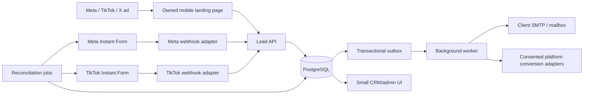

# Owned Real-Estate Lead Capture and CRM Pipeline

Status: architecture and implementation plan  
Evidence cut-off: **2026-07-30** (Asia/Calcutta)  
Scope: Facebook, Instagram, TikTok, and X (formerly Twitter), with no paid CRM/iPaaS/lead-routing product

> This is an engineering design, not legal advice. Advertising and privacy rules depend on the advertiser's country, the audience's country, the property location, and whether the offer is sale, rent, lending, or another regulated service. Those facts are launch inputs, not assumptions.

## 1. Decision in one page

Build an **owned lead-capture service with a small CRM**, not four separate social integrations and not an email-only forwarding script.

The launch path should be:

```text
Facebook / Instagram / TikTok / X ad
        -> HTTPS landing page on the client's domain
        -> owned form API
        -> PostgreSQL transaction (system of record)
        -> transactional outbox
        -> email worker -> client's existing mailbox/SMTP service
        -> optional consented conversion event back to the ad platform
```

Every supported platform can send a paid ad click to an external website. Meta explicitly supports a Leads campaign whose conversion location is `Website`; TikTok explicitly supports website lead generation; X supports Website Traffic and Website Conversions. This route provides one form, one privacy model, one validation layer, and one reliable lead store.

Add native platform forms only after the website route is stable:

- **Meta Instant Forms**: worthwhile as a phase-two acquisition adapter. Receive `leadgen` webhooks, retrieve the lead with the Graph API, normalize it, and pass it through the same lead service.
- **TikTok Instant Forms**: optional phase two/three adapter where TikTok is legally and commercially available. Use TikTok Custom API + webhooks and a reconciliation job.
- **X**: use an external landing page. Do not design around old Twitter Lead Generation Cards; the current official X material supports website traffic/conversion ads, not a current native lead-form CRM feed.

Email is a **notification channel**, never the source of truth. If SMTP is down, the accepted lead must remain in the database and the worker must retry. A successful form response must mean “stored durably,” not “an email send was attempted.”

### What is and is not being avoided

No HubSpot, Salesforce, Zoho, Zapier, Make, LeadsBridge, or paid form/CRM product is required. The system uses owned application code and open-source infrastructure. The following unavoidable costs remain:

- ad spend paid to each advertising platform;
- a domain, compute/VPS, database storage, backups, and monitoring infrastructure;
- an email mailbox or SMTP service (prefer the client's existing domain email service);
- engineering, security, legal review, and operations.

Self-hosting a public mail server solely to avoid an email provider is not recommended: IP reputation, abuse handling, SPF/DKIM/DMARC, queueing, bounce processing, and block-list remediation become a separate production system.

## 2. Facts that must be collected before implementation

The client must answer and sign off on these. A launch without them is unsafe.

| Area | Required answer | Why it changes the design |
|---|---|---|
| Advertiser legal entity | Legal name, registered address, licence/registration numbers | Landing-page disclosure and platform verification |
| Markets | Advertiser country, audience countries, property countries | Platform availability, privacy law, housing-ad restrictions, data residency |
| Offering | Sale, rent, brokerage, new development, mortgage referral, investment | “Housing” and “credit” categories have different restrictions |
| Lead owner | One business or multiple branches/agents | Tenant model, routing, access control, retention controller |
| Contact policy | Call/email/SMS/WhatsApp, hours, SLA | Consent wording and notification routing |
| Data fields | Minimum qualification fields actually used by sales | Data minimization and native-form compatibility |
| Retention | Business/legal retention period per state/market | Deletion scheduler, backups, privacy notice |
| Email | Client-owned recipient aliases and SMTP/OAuth capability | Delivery implementation and security |
| Volume | Expected clicks/leads per day and peak campaign bursts | Capacity, rate limits, alert thresholds |
| Admin users | Named users, roles, identity provider/MFA | CRM access and auditability |
| TikTok market | Is TikTok legally available to advertiser and audience? | Whether it can be in scope at all |

### India-specific gate

The Government of India blocked TikTok in its 29 June 2020 order. No official revocation was found in this review. Therefore, for an India-based/India-targeted deployment, TikTok must be marked **not launchable unless current written legal/platform confirmation establishes otherwise**. Do not use VPNs or other circumvention. See the [Government of India release](https://www.pib.gov.in/Pressreleaseshare.aspx?PRID=1635206&lang=2&reg=48).

If this is an India deployment, add two more gates:

- **RERA**: establish whether the client is the promoter, a registered real-estate agent, or both; verify the project and agent registration against the relevant state/UT authority. The central RERA Act requires registration for covered agents/projects, prohibits an agent from facilitating a project that should be registered but is not, and requires a promoter's advertisement/prospectus to show the authority website and project registration number. State/UT rules and authority orders can add presentation requirements (for example, QR codes), so the landing page and every social creative need state-specific review.
- **Data protection transition**: the Digital Personal Data Protection Rules, 2025 were notified on 14 November 2025 with staged commencement. The central notification schedules most substantive processing/rights provisions of the DPDP Act, and Rules 3 and 5-16, for 18 months after publication (14 May 2027), while other provisions commence earlier. As of this document's cut-off, do not inaccurately claim that every DPDP duty is already in force. Build the notice, consent evidence, security, rights, retention, and deletion capabilities now; have Indian counsel identify the currently applicable IT/privacy rules and the exact transition obligations before launch.

## 3. Platform capability matrix (verified 2026-07-30)

| Platform | Paid ad -> owned site | Native lead form | First-party native-form automation | Organic clickable route | Recommended role |
|---|---|---|---|---|---|
| Facebook | Yes: Leads/Website or Traffic destination | Yes: Instant Form | Meta Graph API + Page `leadgen` webhook and lead retrieval | Page posts can carry URLs; ad CTA is more controllable | Website form at launch; Instant Forms after stabilization |
| Instagram | Yes: created/managed through Meta Ads Manager | Yes: Meta Instant Forms and messaging lead routes | Same Meta Page/Graph lead pipeline; not a separate CRM API | Story link sticker; paid Story/Reel CTA. Do not assume caption text is a reliable clickable link | Same as Facebook, managed as Meta placements |
| TikTok | Yes: Website Lead Generation | Yes: Instant Form | TikTok Custom API + webhook; retrieve/reconcile leads | Destination Links exist only for eligible verified accounts/markets; organic lead-gen links also have eligibility gates | Website form where available; Instant Form optional |
| X | Yes: Website Traffic / Website Conversions; Website Card URL | No current equivalent established in official docs reviewed | Not applicable for native forms; Pixel/CAPI are measurement, not lead retrieval | URLs in posts are clickable and wrapped by `t.co` | External landing page only |

Important distinction: **lead retrieval** and **conversion feedback** are different integrations.

- Retrieval imports a native form submission into the owned CRM.
- Pixel/Conversions API/Events API reports a consented website or downstream CRM event to an ad platform for measurement/optimization.
- A conversion API does not forward the lead to the client's email and is not a CRM.

## 4. Platform routes in detail

### 4.1 Facebook and Instagram (Meta)

Facebook and Instagram advertising share Meta Ads Manager. Create a campaign with:

1. Objective: **Leads**.
2. Conversion location: **Website** for the owned form.
3. Destination: the canonical landing-page URL.
4. Placements: Facebook and/or Instagram based on the approved creative and campaign test.
5. Special Ad Category: **Housing** wherever Meta requires it for the advertiser/target market.
6. Tracking parameters: immutable IDs or controlled slugs, not only names that marketers may edit.

Meta's current lead-form page explicitly says forms may open from the ad or be hosted on the advertiser's website, and gives `Leads -> Website -> destination URL` as a supported setup. Meta Ads Manager is the unified creation tool for Facebook and Instagram.

#### Native Meta Instant Form adapter (phase two)

Use this only if the expected conversion-rate benefit justifies the added operational surface.

```text
Person submits Meta Instant Form
  -> Meta Page `leadgen` webhook notification
  -> POST /webhooks/meta/leadgen
  -> verify challenge/signature according to the pinned Graph version
  -> persist delivery ID / leadgen ID (idempotent)
  -> acknowledge quickly
  -> worker retrieves lead by ID with Page access token
  -> map form field IDs to canonical schema
  -> upsert contact + create immutable inquiry
  -> enqueue notification
  -> periodic API reconciliation catches missed webhooks
```

Production prerequisites:

- Meta Business Portfolio, ad account, Facebook Page, and linked Instagram professional account where applicable;
- a Meta developer app in Live mode;
- Page/business asset access granted to the client-owned app/system user;
- the current required permissions, including `leads_retrieval`, plus current Page permissions required by Meta's Lead Ads documentation;
- Advanced Access/App Review and Business Verification when required;
- HTTPS webhook endpoint, verification token, app-secret-based request verification, and a pinned supported Graph API version;
- encrypted token storage, least privilege, token health monitoring, revocation workflow, and test leads.

Do not freeze a permission list or Graph version from this document into code. Meta changes versions and permission prerequisites. At implementation time, record the chosen version, exact permissions, approval evidence, token owner, and deprecation date in an integration runbook. Official starting points: [Lead Ads retrieval](https://developers.facebook.com/docs/marketing-api/guides/lead-ads/retrieving/), [Lead Ads webhook integration](https://developers.facebook.com/docs/marketing-api/guides/lead-ads/quickstart/webhooks-integration/), and Meta's [official Marketing API workspace](https://www.postman.com/meta/facebook-marketing-api/overview).

#### Meta measurement (optional, consent-gated)

For the website path, send a browser `Lead` event with Meta Pixel and/or a matching server event through Conversions API. If both are used, use the same event ID for deduplication. Keep platform delivery asynchronous from form acceptance. Hash contact match fields exactly as the current platform contract requires, and do not send prohibited/sensitive fields.

The Conversions API is not a privacy bypass. Meta explicitly states it remains subject to user controls, Business Tools Terms, and applicable privacy rules. Load advertising cookies/pixels only after the consent decision required for the visitor's jurisdiction.

### 4.2 TikTok

Where TikTok is available, TikTok Ads Manager supports:

- Lead Generation with optimization location **Website**; or
- Lead Generation with an **Instant Form**.

For website lead generation, point the CTA at the canonical landing page, install consent-gated TikTok Pixel if approved, and optionally send a matching server-side `Lead` event using Events API. TikTok recommends Pixel + Events API with event deduplication. Capture the auto-appended `ttclid`; do not replace the platform value with a made-up identifier.

TikTok's May 2025 web-lead event list includes `Lead`, `Contact`, `CompleteRegistration`, and `Schedule`. Use `Lead` for a durable contact-form submission. Do not fire it on button click or on form render.

#### Native TikTok Instant Form adapter (optional)

```text
Person submits TikTok Instant Form
  -> TikTok LEAD webhook (HTTPS JSON)
  -> POST /webhooks/tiktok/leads
  -> validate according to the current webhook verification contract
  -> store request/lead/form IDs idempotently and acknowledge
  -> retrieve/normalize lead where required
  -> contact + inquiry transaction
  -> email outbox
  -> scheduled reconciliation through lead retrieval/export API
```

Use TikTok's **Custom API with Webhooks**, not Zapier or LeadsBridge. TikTok's official material states that Custom API + Webhooks provides real-time CRM updates. The API for Business documents a `LEAD` webhook subscription and lead retrieval endpoints.

Operational constraints:

- connect the webhook before campaign launch; TikTok states leads collected before the integration is completed are not backfilled through that webhook;
- TikTok Ads Manager stores Instant Form lead data for **90 days**, so the owned store and reconciliation process are mandatory;
- select the Higher Intent form variant where appropriate; TikTok documents an added review screen and CAPTCHA;
- the form requires a valid privacy-policy URL and cannot be edited after completion (copy it to create a new version);
- field mapping is versioned by Instant Form ID;
- real-estate landing pages must disclose advertiser information/contact details and meet market-specific eligibility/licensing rules;
- Destination Links on organic videos are not universal. Current availability requires a verified business, data connection, eligible customer/region, and platform review.

### 4.3 X (formerly Twitter)

Use an X **Website Traffic** or **Website Conversions** campaign whose creative points to the owned landing page.

Current official X documentation supports:

- Website Traffic optimized for site visits/link clicks;
- Website Conversions as a campaign objective;
- Image Ads with Website Card URLs beginning with HTTP(S);
- X Pixel and server-to-server Conversion API for measurement;
- clickable URLs in organic posts, wrapped by `t.co`.

It does not establish a current native lead-form + lead-retrieval product equivalent to Meta/TikTok. Therefore:

- do not implement an X inbound lead webhook;
- do not resurrect examples for deprecated Twitter Lead Generation Cards;
- treat X Pixel/CAPI as optional measurement only;
- capture `twclid` when present and preserve UTMs;
- follow X URL rules: valid working page, no excessive redirects/pop-ups, no forced sign-in, and no swapped destination after promotion.

X Ads currently requires an eligible account and states that business/government advertiser accounts must qualify through its verification route. For US/Canada housing ads, obtain required pre-approval and follow targeting restrictions. Outside those markets, the global anti-discrimination and local-law obligations still apply.

## 5. Recommended system architecture

Use a modular monolith first. Four microservices and a streaming platform would add failure modes without improving this workload.



### Concrete stack

Recommended baseline (all application components are owned/self-hostable):

| Layer | Choice | Reason |
|---|---|---|
| Language | TypeScript on a pinned Node.js LTS | One type system across form, API, worker, and tests |
| Web UI | Next.js, server-rendered landing pages | Fast mobile render, accessible forms, campaign/property pages |
| API | Fastify (or a strict Next server boundary for MVP) + Zod | Small, typed HTTP surface; explicit webhook raw-body handling |
| Database | PostgreSQL | Transactions, uniqueness, JSONB for versioned source metadata, reporting |
| Jobs | PostgreSQL outbox + worker using `FOR UPDATE SKIP LOCKED` | No Redis dependency for initial scale; durable retries |
| Email | Nodemailer over client-owned SMTP with OAuth/app credential | Works with existing mailbox infrastructure; no CRM vendor |
| Proxy/TLS | Caddy or Nginx | TLS termination, request limits, security headers |
| Packaging | Docker Compose initially | Reproducible deploy without premature orchestration |
| Testing | Vitest, Playwright, contract fixtures | Unit, browser/in-app-browser, and webhook replay coverage |
| Observability | Structured JSON logs, OpenTelemetry-compatible metrics/traces | Vendor-neutral; PII-safe operational evidence |

Alternative languages are acceptable. The invariants—durable transaction, outbox, idempotency, normalized schema, and replay—matter more than the framework.

### Suggested repository layout

```text
apps/
  web/                    # public landing pages + authenticated admin UI
  api/                    # public lead API and platform webhook endpoints
  worker/                 # email, conversion feedback, reconciliation, retention
packages/
  domain/                 # lead/contact/status models and business rules
  db/                     # migrations and repositories
  integrations/
    meta/
    tiktok/
    x/
    smtp/
  observability/
infra/
  compose/
  proxy/
docs/
  runbooks/
  decisions/
```

## 6. Public URL and attribution contract

Use a first-party subdomain, for example:

```text
https://leads.client.example/p/{property-slug}
  ?utm_source=facebook|instagram|tiktok|x
  &utm_medium=paid_social
  &utm_campaign={stable-campaign-key}
  &utm_content={stable-creative-key}
```

Rules:

1. The property slug resolves to an internal immutable `property_id`.
2. UTMs are allow-listed, length-limited, and stored as untrusted text.
3. Also capture platform click IDs when present: Meta click metadata (`fbclid`/derived first-party identifiers as allowed by the current contract), TikTok `ttclid`, and X `twclid`.
4. Store first touch and submission touch separately; never overwrite the original touch silently.
5. Do not put name, email, phone, budget, or other PII in the URL.
6. Preserve parameters across an in-app browser redirect, but keep redirects to zero or one.
7. Never trust `utm_source` as proof that a request came from a platform. It is attribution metadata, not authentication.
8. Campaign IDs/names sent by native webhooks remain source metadata; they do not replace internal IDs.

Attribution reports will not exactly match platform reports. Platforms and the CRM use different windows, identity matching, consent, time zones, view-through rules, and event-time semantics. Define the CRM's report as **observed submissions by stored first/submission touch**, and treat platform numbers as platform-attributed conversions.

## 7. Form design

### Required fields for MVP

- full name;
- at least one validated contact method: email or international-format phone;
- inquiry type: buy, rent, sell, or request information;
- property/listing or area of interest;
- preferred contact method and contact window;
- acknowledgement that the user is requesting contact;
- privacy notice link and consent-record metadata.

### Optional qualification fields

- property type;
- bedroom range;
- budget **range**, not bank/credit details;
- expected move/purchase time frame;
- short free-text question with a strict length limit.

Do not collect government IDs, exact financial-account data, passwords, protected traits, health data, race/religion/caste, or detailed credit information in the lead form. If a later regulated process needs sensitive data, build a separate authenticated workflow with its own legal/security assessment.

### Consent model

Separate these purposes:

1. **Requested contact**: necessary to answer this property inquiry.
2. **Optional marketing**: future unrelated property promotions; unchecked by default where required.
3. **Optional ad measurement/personalization**: platform pixels/server events; applied according to jurisdiction and consent mode.

Store an immutable consent snapshot: notice version, rendered text/hash, purposes, user choices, timestamp, locale, collection surface, and source form ID. A link to a mutable privacy page alone is not sufficient audit evidence.

### UX requirements

- mobile-first and tested inside each platform's in-app browser;
- useful content before the form: business identity, property facts, price/range where lawful, location, fees/disclosures, and contact details;
- no account/sign-in requirement;
- accessible labels, focus order, errors, colour contrast, and screen-reader announcements;
- server-side validation identical to or stricter than client validation;
- success page returns a reference number and realistic response-time expectation;
- no false scarcity, hidden preselected marketing consent, or misleading CTA.

## 8. API contract

### Owned website submission

```http
POST /api/v1/leads
Content-Type: application/json
Idempotency-Key: <random UUID generated for this form attempt>
```

Representative payload:

```json
{
  "formVersion": "property-inquiry-1.0",
  "propertyId": "prop_01...",
  "contact": {
    "fullName": "Example Person",
    "email": "person@example.com",
    "phone": "+15551234567",
    "preferredChannel": "phone"
  },
  "inquiry": {
    "intent": "buy",
    "budgetBand": "300000-400000",
    "timeframe": "1-3-months",
    "message": "Please arrange a viewing."
  },
  "attribution": {
    "utmSource": "instagram",
    "utmMedium": "paid_social",
    "utmCampaign": "summer-condos-2026",
    "utmContent": "reel-03",
    "platformClickId": "<opaque>"
  },
  "consent": {
    "privacyNoticeVersion": "2026-07-30",
    "requestedContact": true,
    "marketing": false,
    "adMeasurement": false
  }
}
```

Return `201 Created` only after the lead/inquiry, consent record, attribution touch, and outbox row commit in one database transaction. Return the same result for a replayed idempotency key with the same request hash. Reject reuse of a key with a different body.

### Integration endpoints

```text
GET|POST /webhooks/meta/leadgen       # verification + notifications
POST     /webhooks/tiktok/leads       # notifications
GET      /health/live                 # process health only
GET      /health/ready                # database/dependency readiness, protected details
```

Webhook endpoints must:

- preserve the raw request bytes required for platform verification;
- validate current platform authenticity requirements before processing;
- reject oversized or malformed requests;
- deduplicate platform delivery/request/lead IDs;
- persist the notification and acknowledge quickly;
- do remote lead retrieval and email work asynchronously;
- tolerate duplicated, delayed, batched, and out-of-order delivery.

## 9. Data model

Keep contacts and inquiries separate. One person can submit multiple legitimate property inquiries; deduplicating them into one row destroys attribution and sales history.

| Entity | Important fields / invariant |
|---|---|
| `contacts` | normalized email/phone hashes for lookup; encrypted display values; merge history |
| `inquiries` | immutable source, property, form version, intent, submitted time, current status |
| `attribution_touches` | first/submission touch, UTMs, click ID (opaque), referrer, landing URL without PII |
| `consent_records` | purpose choices, notice version/hash, locale, time, collection surface |
| `source_deliveries` | platform, delivery/request ID, external lead ID, received time, verification status, payload hash |
| `form_mappings` | platform form ID + version -> canonical field mapping |
| `lead_status_history` | append-only old/new state, actor, reason, timestamp |
| `assignments` | inquiry, agent/branch, assigned time, SLA |
| `outbox_events` | event type, aggregate ID, payload, attempt count, next attempt, state |
| `notification_deliveries` | recipient, message ID, attempt, accepted/bounced state where available |
| `integration_credentials` | secret-manager reference only; never raw token in normal rows/logs |
| `audit_events` | actor, action, object, time, request/correlation ID; no secret values |

Suggested lifecycle:

```text
new -> assigned -> contacted -> qualified -> viewing_scheduled -> won
                       |             |                 |
                       +-----------> lost <------------+
new/assigned/contacted -> spam
any non-deleted state -> deletion_pending -> deleted/anonymized
```

State changes require actor, timestamp, and reason. Do not let an email send change business status to “contacted.”

### Deduplication

- Submission uniqueness: `(source_platform, external_lead_id)` for native leads; `Idempotency-Key + request_hash` for website leads.
- Contact candidate match: normalized phone and case-normalized email, scoped to the client/tenant.
- Never discard a repeated inquiry. Link it to an existing contact and flag it for review.
- Do not merge contacts automatically when email and phone point to different existing people.

## 10. Email notification pipeline

In the form transaction, insert `LeadCreated` into the outbox. The worker then:

1. locks a due outbox row;
2. renders an escaped template;
3. routes to an allow-listed alias based on branch/property;
4. sends through client-owned SMTP using TLS and OAuth/app credential;
5. records the SMTP message ID/result;
6. marks success, or schedules exponential backoff with jitter;
7. moves repeatedly failing work to a dead-letter state and alerts operations.

Delivery semantics are **at least once**. Set a stable notification key/message header so duplicate investigation is possible. SMTP acceptance is not proof that a human read the email.

Recommended message:

- subject: `[New lead] <property> · <intent> · <reference>`;
- concise contact and qualification fields;
- source/campaign/creative metadata;
- consented contact channels;
- a link to the authenticated CRM record;
- no secrets, access tokens, raw webhook JSON, or unnecessary tracking identifiers.

The client's requirement says “all information to email.” The safer default is minimum actionable data plus a secure CRM link because mailboxes are broadly copied, forwarded, backed up, and retained. If the client insists on all collected fields in mail, document that risk, restrict recipients, enforce MFA, and still never include platform tokens or prohibited sensitive data.

Email hardening:

- validate and allow-list recipients; users never supply the destination;
- prevent header injection; render user text as text/escaped HTML;
- configure SPF, DKIM, and DMARC for the sending domain;
- use a stable `From` address and put the lead's address in a sanitized `Reply-To` only if approved;
- alert on backlog age, failure rate, authentication failure, and bounce spikes;
- provide an admin “resend notification” action that creates a new audited delivery attempt.

## 11. Security, privacy, and abuse controls

### Application security

- TLS only, HSTS, secure cookies, restrictive CSP, frame protections, and explicit CORS;
- CSRF protection on browser submissions plus origin checks; webhook routes use platform authentication instead;
- body/field length limits, schema validation, parameterized SQL, and output encoding;
- rate limits by IP/network and form/property, with burst allowance for carrier NAT;
- honeypot, minimum credible completion time, duplicate velocity rules, and server-side spam scoring;
- add a CAPTCHA/proof step only after measured abuse; do not silently fingerprint visitors;
- authenticated admin with MFA, RBAC (`admin`, `manager`, `agent`, `auditor`), short sessions, and audit log;
- encrypt volumes/backups and high-risk PII fields; separate encryption keys from database credentials;
- secrets in a secret store or protected runtime files, never Git, URLs, logs, or frontend bundles;
- dependency and container scanning, pinned lockfiles/images, and scheduled patching;
- fixed outbound hosts for platform APIs/SMTP to reduce SSRF and exfiltration paths.

### Privacy operations

- publish accurate privacy and cookie notices naming the client as controller and explaining platform measurement;
- define lawful basis/consent per market with counsel;
- record data processors/subprocessors, hosting regions, and cross-border transfers;
- implement access/export/correction/deletion workflows and identity verification;
- maintain retention by data class: inquiries, consent evidence, webhook raw payloads, audit logs, backups;
- expire raw webhook payloads sooner than normalized business records unless a concrete need exists;
- propagate deletion/anonymization to search indexes, exports, and conversion audiences where required;
- suppress future marketing after opt-out without erasing evidence needed to honour the suppression;
- never log full request bodies, email addresses, phone numbers, click IDs, or tokens.

### Housing/real-estate advertising controls

- Meta: declare the Housing Special Ad Category wherever required; Ads Manager explicitly requires the relevant category for housing campaigns.
- TikTok: its global anti-discrimination policy expressly covers housing. In the US/Canada, the HEC policy requires the Special Ad Category and restricts age, gender, ZIP code, marital/parental status, and protected-characteristic proxies.
- X: US/Canada housing/realtor advertisers require pre-approval and cannot use prohibited targeting dimensions including age, sex, protected status, or precise ZIP-level location.
- Globally: do not write copy such as “ideal for [religion/race/family status]” or use targeting/exclusions as a proxy for protected traits. Local fair-housing law can be stricter than platform UI.
- Landing-page claims, price, availability, business identity, fees, licences, imagery, and property details must match the ad and be supportable.

## 12. Reliability and operations

### Service objectives

Initial internal targets (revise after real traffic):

- accepted website lead durability: no acknowledged lead without a committed DB row;
- p95 form API response under 1 second excluding client network;
- p95 accepted lead -> first email attempt under 60 seconds;
- webhook endpoints acknowledge persisted valid notifications within 2 seconds;
- email backlog oldest age alert at 5 minutes, critical at 30 minutes;
- daily automated backup plus PostgreSQL point-in-time recovery where affordable;
- quarterly restore test to a clean environment.

### Required scheduled jobs

- email/outbox dispatch and dead-letter alerting;
- Meta/TikTok native lead reconciliation for forms enabled in this CRM;
- platform credential health/expiry check;
- retention/anonymization and backup-expiry enforcement;
- stale unassigned lead and contact-SLA alerts;
- daily source-count anomaly report (zero leads during an active campaign, unusual spike, webhook/API mismatch).

### Observability

Metrics should include:

- landing views, form starts, validation failures, accepted leads, and conversion rate by internal campaign key;
- leads by `source x form x property`, duplicates, spam score distribution;
- webhook verified/rejected/duplicate counts and retrieval lag;
- reconciliation gaps and recovered leads;
- outbox depth/oldest age, email attempts/failures/bounces;
- token time-to-expiry and API error/rate-limit counts;
- lead assignment and first-contact SLA.

Logs use correlation IDs and opaque internal lead IDs. A protected admin audit view may resolve those IDs; the log platform should not contain PII.

## 13. Delivery plan

### Phase 0 — discovery and compliance gate

Deliverables:

- completed inputs from section 2;
- written data-field and consent matrix per target market;
- advertising account/asset ownership map;
- real-estate licences/disclosures and approved privacy/cookie text;
- TikTok availability decision;
- SMTP capability test and recipient routing map;
- threat model and retention decision.

Exit criterion: the client signs off on fields, markets, contact purpose, retention, and account ownership.

### Phase 1 — website lead path (recommended MVP)

Build:

- property/campaign landing-page template;
- `POST /api/v1/leads` with validation and idempotency;
- PostgreSQL schema/migrations;
- outbox worker and SMTP notification;
- thank-you/reference flow;
- source attribution capture;
- basic admin list/detail/status/assignment;
- structured PII-safe logs, metrics, backup, and runbooks.

Launch first with measurement pixels disabled or strictly consent-gated. Point test ads from Meta and X—and TikTok only where allowed—to the same owned route.

### Phase 2 — operational CRM and measurement

- RBAC/MFA, audit history, saved filters, export with authorization;
- SLA alerts, lead ownership, notes, status funnel;
- consent manager behavior and platform Pixel/CAPI/Events adapters approved by legal;
- SPF/DKIM/DMARC and bounce/backlog monitoring;
- dashboard comparing CRM-observed and platform-attributed counts without pretending they are identical.

### Phase 3 — Meta Instant Forms

- Meta app/business verification and permission review;
- `leadgen` webhook, lead retrieval, field mapper, replay fixtures;
- reconciliation and token-health job;
- test-lead-to-email acceptance run;
- controlled A/B test: website form vs higher-intent native form, judged on **qualified lead rate**, not just cost per form submission.

### Phase 4 — TikTok Instant Forms (only if market gate passes)

- TikTok API for Business access and Custom API webhook subscription;
- per-form mapping, higher-intent configuration, privacy link;
- retrieval/export reconciliation within the 90-day platform window;
- conversion-feedback events only with approved consent/legal basis.

### Phase 5 — optimization, not speculative features

Only after production data exists:

- routing by geography/property/working hours;
- appointment scheduling;
- lead scoring based on explicit inquiry data (never protected traits/proxies);
- downstream qualified/won conversion feedback where platform terms and consent allow;
- multi-client tenancy only if the company truly turns this into a product.

## 14. Acceptance and failure tests

### End-to-end

- each ad preview opens the exact approved HTTPS page in iOS/Android in-app browsers;
- all platform/placement URL parameters survive and map to the correct property/campaign;
- form works with JavaScript delayed and reports accessible validation errors;
- one submission creates one inquiry, one consent record, and one outbox event;
- rapid double-click/retry returns the same lead reference;
- SMTP outage still returns success after durable storage, queues retry, and alerts;
- notification content is escaped and cannot inject headers/HTML/script;
- CRM user sees only authorized branch/client data.

### Native adapters

- official test lead reaches the correct endpoint and normalized record;
- invalid webhook authenticity check is rejected and counted;
- duplicate/batched/out-of-order webhooks do not duplicate inquiries;
- API timeout/rate limit schedules retry without blocking webhook acknowledgement;
- expired/revoked token alerts and reconciliation reports a gap;
- field change/new form version fails to a visible mapping-review state, not silent nulls;
- reconciliation recovers a webhook intentionally dropped in the test environment.

### Privacy/security

- rejecting optional ad consent prevents advertising scripts/cookies/server events as required;
- marketing unchecked still permits the specifically requested inquiry response, per approved notice;
- deletion/export workflow covers normalized records, exports, and scheduled backup expiry;
- PII does not appear in access logs, exception traces, metrics labels, or alert payloads;
- rate limiting does not block an entire mobile carrier NAT during expected bursts;
- backup restoration produces a usable, access-controlled CRM.

### Launch checklist

- ad, landing page, privacy notice, licence and targeting reviewed per market;
- client owns Business/Ads accounts, developer apps, domain, hosting, mailbox, and recovery methods;
- individual user access is used—no shared social passwords;
- MFA and least privilege enabled;
- production secrets created outside source control and rotation documented;
- webhook subscriptions and test tools verified after final deployment;
- alert recipient and on-call action documented;
- ads remain paused until form, email retry, CRM access, and monitoring pass;
- rollback means pausing ads or switching the destination to a tested maintenance/contact page, never dropping submissions.

## 15. What not to build

- Four separate forms/backends for four platforms.
- A browser-only form that calls SMTP directly or exposes mailbox credentials.
- A form that returns success before durable storage.
- Email forwarding with no database, retry, deduplication, or audit record.
- Polling-only native ingestion when an official webhook exists; use webhook + reconciliation.
- A webhook-only design with no reconciliation.
- Automatic merging that deletes repeat inquiries.
- Pixels/CAPI/Events enabled before consent/legal review.
- An Ads API campaign-management product; Ads Manager is sufficient for the stated requirement.
- A self-hosted mail server, Kubernetes, Kafka, or ML lead scoring for the MVP.
- Scraping platform inboxes/forms or automating personal accounts.
- Any TikTok circumvention in a blocked market.

## 16. Open decisions and risks

| Risk / decision | Current position | Owner / closure evidence |
|---|---|---|
| Target countries unknown | Blocks final compliance and TikTok decision | Client + counsel; signed market list |
| Email provider unknown | Use existing client-domain SMTP; test OAuth/app credential | Client IT; successful staging send/receive |
| “All information in email” | Recommend minimum actionable PII + CRM link | Client risk acceptance or revised requirement |
| Native-form volume benefit unknown | Website first, then controlled experiment | Marketing; qualified-lead results |
| Meta/TikTok API approval time | Not on MVP critical path | Platform owner; approved app/permissions |
| Platform API/version drift | Pin version and record deprecation; quarterly review | Engineering runbook |
| Attribution mismatch | Expected; document CRM vs platform definitions | Analytics definition signed off |
| Legal advice absent | Engineering controls are not a legal opinion | Qualified local counsel |

## 17. Evidence and official-source register

Research method:

1. Prefer current platform Help/Business/Developer documentation and government sources.
2. Cross-check product marketing pages against setup/API/policy pages.
3. Treat availability statements as conditional when official docs say “eligible,” “select,” or market-specific.
4. Do not infer that a conversion API retrieves lead data.
5. Do not infer a current product from an old blog/tutorial. Absence claims (notably X native forms) are scoped to the current official product/docs reviewed.

All sources below were checked on **2026-07-30**. Platform documentation is mutable; re-check the linked policy and implementation pages immediately before launch.

### Meta (Facebook and Instagram)

- [Meta lead ads with instant or website forms](https://www.facebook.com/business/ads/ad-objectives/lead-generation/lead-ads-with-forms) — current supported form destinations and CRM/CAPI distinction.
- [Meta lead ads overview](https://www.facebook.com/business/ads/ad-objectives/lead-generation) — forms, messaging, and calling routes.
- [Create campaigns in Meta Ads Manager](https://www.facebook.com/help/messenger-app/621956575422138/) — unified Facebook/Instagram campaign hierarchy, destination links, and Special Ad Category requirement.
- [Instagram ads](https://www.facebook.com/business/ads/instagram-ad) — Instagram advertising through Ads Manager and use of a destination.
- [Instagram Story link sticker](https://www.facebook.com/help/instagram/192168966243613) — organic sticker and paid Story CTA behavior.
- [Meta Conversions API](https://www.facebook.com/business/help/AboutConversionsAPI) — server events, Pixel pairing, controls, and non-bypass statement.
- [Set up Meta Pixel](https://www.facebook.com/help/messenger-app/952192354843755/) — dataset/pixel setup and manual CAPI option.
- [Meta Business Tools Terms](https://www.facebook.com/legal/terms/businesstools/preview) — lawful basis, sensitive-data restriction, notice/consent, and tool terms.
- [Meta Lead Ads Terms](https://www.facebook.com/ads/leadgen/tos) — advertiser responsibility for lead features.
- [Meta Lead Ads retrieval developer guide](https://developers.facebook.com/docs/marketing-api/guides/lead-ads/retrieving/) — production lead retrieval contract.
- [Meta Lead Ads webhook integration](https://developers.facebook.com/docs/marketing-api/guides/lead-ads/quickstart/webhooks-integration/) — native-form webhook contract.
- [Meta official Marketing API Postman workspace](https://www.postman.com/meta/facebook-marketing-api/overview) — official, current API request workspace and prerequisites.

### TikTok

- [Lead Generation objective](https://ads.tiktok.com/help/article/lead-generation-objective) — Instant Form and owned-website paths; updated January 2026.
- [Create an Instant Form](https://ads.tiktok.com/help/article/build-instant-form?lang=en) — privacy URL, higher-intent/CAPTCHA, tracking parameters, immutable completed form; updated June 2026.
- [Available CRM integrations](https://ads.tiktok.com/help/article?aid=10001704) — Custom API with Webhooks as a first-party integration option.
- [API for Business webhook subscription](https://ads.tiktok.com/gateway/docs/index?doc_id=1734504383985666&identify_key=2b9b4278e47b275f36e7c39a4af4ba067d088e031d5f5fe45d381559ac89ba48&language=ENGLISH) — `LEAD` subscription and notification schema.
- [API for Business portal](https://business-api.tiktok.com/portal) — lead generation, retrieval, and webhook capabilities.
- [Troubleshoot webhooks](https://ads.tiktok.com/help/article/troubleshoot-webhooks?lang=en) — no webhook synchronization for leads predating completed integration.
- [Access lead data](https://ads.tiktok.com/help/article/access-leads-data?lang=en&redirected=2) — 90-day Ads Manager availability and admin-only access; updated December 2025.
- [About Events API](https://ads.tiktok.com/help/article/events-api?lang=en) — Pixel + Events API and deduplication recommendation.
- [Web lead-generation events](https://ads.tiktok.com/help/article/available-events-for-web-lead-generation) — `Lead`, `Contact`, and other supported events.
- [TikTok Click ID](https://ads.tiktok.com/help/article/tiktok-click-id?lang=en) — `ttclid` auto-attachment and attribution use.
- [Lead-ad format/privacy requirements](https://ads.tiktok.com/help/article/tiktok-ads-policy-ad-format-and-functionality?lang=en) — working landing pages, privacy policy, and prohibited sensitive questions; updated April 2026.
- [Lead data security](https://ads.tiktok.com/help/article/about-leads-data-security?lang=en) — access roles and controller responsibilities.
- [Real-estate advertising requirements](https://ads.tiktok.com/help/article/tiktok-ads-policy-other-products-and-services?lang=en) — licensing, landing-page disclosure, and market exclusions.
- [Housing/Employment/Credit policy](https://ads.tiktok.com/help/article/housing-employment-credit-hec-ad-policy?redirected=1) — US/Canada declaration and targeting limits; updated April 2026.
- [Anti-discrimination ad policy](https://ads.tiktok.com/help/article/tiktok-anti-discrimination-ad-policy?lang=en&redirected=1) — global targeting/content responsibilities.
- [Destination Links overview](https://ads.tiktok.com/help/article/about-destination-links/) — conditional eligibility and market list; updated May 2026.

### X

- [Create a Website Traffic campaign](https://business.x.com/en/help/campaign-setup/create-a-website-traffic-campaign) — external website route, site visits, Pixel, and reporting.
- [Current campaign objectives](https://business.x.com/en/advertising/campaign-types) — Website Traffic and Website Conversions.
- [Creative specifications](https://business.x.com/en/help/campaign-setup/creative-ad-specifications) — Website Card URL requirements.
- [Conversion tracking for websites](https://business.x.com/en/help/campaign-measurement-and-analytics/conversion-tracking-for-websites?lang=en&location=na) — X Pixel, CAPI, deduplication, `twclid`, and developer-account requirement for CAPI.
- [URL requirements for advertising](https://business.x.com/en/help/ads-policies/campaign-considerations/url-requirements-for-advertising) — working/non-gated destination and redirect constraints.
- [How to post links](https://help.x.com/en/using-twitter/how-to-tweet-a-link.html) — clickable organic post links and `t.co` wrapping.
- [X Ads eligibility](https://business.x.com/en/help/ads-policies/campaign-considerations/about-eligibility-for-x-ads) — account verification, profile quality, and self-serve countries.
- [Housing, lending, and credit policy](https://business.x.com/en/help/ads-policies/campaign-considerations/housing-lending-and-employment-opportunities) — US/Canada pre-approval and targeting limits.
- [X Ads policies](https://business.x.com/en/help/ads-policies) — advertiser/legal responsibility and policy index.

### Government / market availability

- [Government of India: blocking of 59 apps including TikTok](https://www.pib.gov.in/Pressreleaseshare.aspx?PRID=1635206&lang=2&reg=48) — official 29 June 2020 order announcement. A new official verification is required before any India TikTok launch.
- [MeitY: Digital Personal Data Protection Rules, 2025](https://www.meity.gov.in/documents/act-and-policies/digital-personal-data-protection-rules-2025-gDOxUjMtQWa) — official rules, corrigendum, and enforcement-timeline materials.
- [DPDP Act commencement notification, G.S.R. 843(E)](https://www.meity.gov.in/static/uploads/2025/11/c56ceae6c383460ca69577428d36828b.pdf) — staged commencement dates for Act provisions.
- [DPDP Rules notification, G.S.R. 846(E)](https://www.meity.gov.in/static/uploads/2025/11/53450e6e5dc0bfa85ebd78686cadad39.pdf) — staged commencement dates for Rules.
- [Ministry of Housing & Urban Affairs: RERA Act, 2016](https://mohua.gov.in/upload/uploadfiles/files/1Real_Estate_Act_2016.pdf) — central project/agent registration, advertising, and agent duties; state/UT implementation still must be checked.
- [India Code: RERA section 11](https://www.indiacode.nic.in/show-data?actid=AC_CEN_17_19_00033_201616_1517807328405&orderno=11&sectionId=8635&sectionno=11) — promoter advertisement disclosure text.

## 18. Final recommendation

Approve **Phase 0 and Phase 1** now: one client-owned landing/form domain, one durable lead database, a small role-based CRM, and an outbox-driven email pipeline. Configure all legally available paid platforms to send clicks there. This meets the client's actual requirement without a commercial CRM or automation vendor and keeps the implementation testable.

Do not put Meta/TikTok native-form API approval on the critical path. Add those adapters only after the common pipeline is proven and only when a measured native-form experiment is worth the extra operational and compliance surface. Use X solely as an external-website acquisition/measurement source. Treat TikTok as unavailable for India unless authoritative current confirmation changes that conclusion.
